# Rust — Conway’s Game of Life in Bevy ECS


## Introduction

Hey all, this is my first tutorial and blog post. I decided to share a tutorial based on some recent things I learned when working with the Bevy game engine for the Rust programming language.

For this article I wanted to focus on how we might recreate one of the oldest computer games/simulations out there, called [Conway’s Game of Life](https://en.wikipedia.org/wiki/Conway%27s_Game_of_Life) created in 1969 by John Conway. The simulation is quite basic in that there are only four rules, but create some very interesting patterns, some only showing up/stabilizing after hundreds or thousands of iterations.

## Prerequisites

This tutorial assumes some familiarity with Rust and a working installation of git. If you aren’t read up, no worries! I have linked some resources to fill in your gaps.

* Installing Rust: [https://www.rust-lang.org/tools/install](https://www.rust-lang.org/tools/install)
* Installing Git: [https://git-scm.com/book/en/v2/Getting-Started-Installing-Git](https://git-scm.com/book/en/v2/Getting-Started-Installing-Git)
* Using Git: [https://www.codecademy.com/learn/learn-git](https://www.codecademy.com/learn/learn-git)

For a Rust editor, I like VSCode these days: [https://code.visualstudio.com/](https://code.visualstudio.com/) — we don’t cover anything VSCode specific in this tutorial, so use whatever editor suits you.

Ensure you are on the latest version of cargo and rust — to do so, execute rustup update to update your tools.

Throughout the tutorial I will be including the full main.rs file to resync. If you want to skip ahead, each section generally has a commit message you can find in [my github repo](https://github.com/bmbenson/bevy-game-of-life) and using git you can follow along with much less typing + copy/paste.

## Getting Started — Display something

In your Rust project workspace initialize the cargo and git workspace:

```
cargo new game-of-life
cd game-of-life
git init
git add .
git commit -m "Initial commit of a new cargo binary workspace."
```
**Note:** While we’re not covering git in this tutorial, I will be injecting reminders to commit the progress from time to time.

Add bevy to your cargo dependencies with: `cargo add bevy`

The cargo add command automatically added the new bevy dependency to your Cargo.toml file. Open up the file to see.

Cargo.toml should look like:

```yaml
[package]
name = "game-of-life"
version = "0.1.0"
edition = "2021"

# See more keys and their definitions at https://doc.rust-lang.org/cargo/reference/manifest.html

[dependencies]
bevy = "0.12.1"
```

***Note:*** As of the writing of this article, the latest bevy is `0.12.1` — If in the future there is an update that causes this tutorial to be incompatible, please reach out and I will work on making an update!

In your src/main.rs file, we’ll add the basic bevy app and run it to be sure the dependencies and the cargo workspace are set up properly. Throughout the code blocks I have included `#![warn(clippy::pedantic)]` which causes the linter to highlight areas of code that do not meet (stringent) best practices, but in some areas the linter suggestions conflict with the methods Bevy uses for passing params into the systems, so you’ll see we disable a few clippy checks where necessary.

```rust
//main.rs
#![warn(clippy::pedantic)]

use bevy::prelude::*;

fn main() {
    println!("Bevy app starting!");
    App::new().run();
    println!("Bevy app complete!");
}
```

When you execute `cargo run` You should see both `println!` lines in the console, but a bevy window does not yet show up to display anything. Let's correct that!

To show a window, we will need to use a Bevy Plugin, — Bevy splits separate parts of the app into plugins. To make a window display, we can get off the ground by adding a set of plugins as a group — one called `DefaultPlugins`.

```rust
//main.rs
#![warn(clippy::pedantic)]

use bevy::prelude::*;

fn main() {
    println!("Bevy app starting!");
    App::new()
        .add_plugins(DefaultPlugins)
        .run();
}
```

Now, when we execute `cargo run` we will see a blank window.

Let’s add a title to the window — instead of using only the default plugins with their default settings, we want to modify the `WindowPlugin` to have a title and specific resolution displayed.

```rust
//main.rs
#![warn(clippy::pedantic)]

use bevy::prelude::*;

// Window starting dimensions
const WINDOW_START_HEIGHT: f32 = 800.0;
const WINDOW_START_WIDTH: f32 = 700.0;
fn main() {
    println!("Game of life app starting!");
    App::new()
        .add_plugins(
            DefaultPlugins.set(WindowPlugin {
                primary_window: Some(Window 
                    title: "Conway's Game of Life".into(),
                    resolution: (WINDOW_START_WIDTH, WINDOW_START_HEIGHT).into(),
                    ..default()
                }),
                ..default()
            })
        )
    .run();
}
```

For this we still use the majority of the DefaultPlugins, but we override the WindowPlugin with our custom settings & leave all others default. Note: The `..default()` is the part that fills in the remaining elements of the struct for us with the defaults, which for Bevy are quite sane.

Execute: `cargo run`

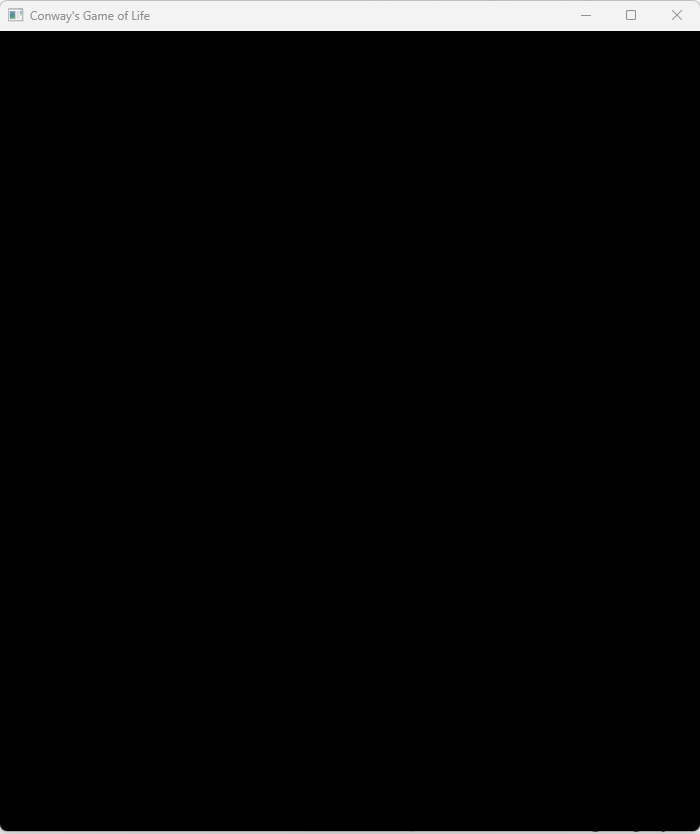

NICE, we have something displayed & our window is titled — let’s commit for good measure!

`git commit -a -m "Window title and display functionality."`

## Adding the game board

Now that we have something displayed, let’s get a game board going.

```rust
//main.rs
#![warn(clippy::pedantic)]

use bevy::prelude::*;

//Default for the tile sizes.
const TILE_SIZE: u16 = 40;

struct Board {
    squares_wide: u16,
    squares_high: u16,
}

fn main() {
    println!("Bevy app starting!");
    let cols = 20;
    let rows = 20;
    let board = Board {squares_wide: cols, squares_high: rows};
    let window_width = TILE_SIZE * board.squares_wide;
    let window_height =  TILE_SIZE * board.squares_high;
    App::new()
        .add_plugins(
            DefaultPlugins.set(WindowPlugin {
                primary_window: Some(Window {
                    title: "Conway's Game of Life".into(),
                    resolution: (f32::from(window_width), f32::from(window_height)).into(),
                    ..default()
                }),
                ..default()
            })
        )
        .run();
}
```

The window displays similar to before, but the implementation is a bit more flexible with a custom board size, so we can change it easily in the future if we want a tiny or massive board (though we’ll likely want to decouple from a fixed pixel count per square if we get too large).

To actually display something inside the window we need what Bevy calls a camera. In this case for our Game Of Life, we will be using a 2d camera. Bevy is an Entity Container System style engine, and for adding the camera we’ll add it as a system. See [here](https://bevyengine.org/learn/book/getting-started/ecs/) for more background and details on the benefits of ECS. The major benefit it brings is the ability to separate out the data representations we need for our game from the functions (systems) that use them.

To add the camera, we will need to create an initialization function that adds the one-time elements to our app, which will be the 2d camera and a background — We do this by calling `.add_systems(Startup, initial_setup)` during our app build.

```rust
//main.rs
#![warn(clippy::pedantic)]

use bevy::prelude::*;

//Default for the tile sizes.
const TILE_SIZE: u16 = 40;

struct Board {
    squares_wide: u16,
    squares_high: u16,
}

fn main() {
    println!("Bevy app starting!");
    let cols = 20;
    let rows = 20;
    let board = Board {squares_wide: cols, squares_high: rows};
    let window_width = TILE_SIZE * board.squares_wide;
    let window_height =  TILE_SIZE * board.squares_high;
    App::new()
        .add_plugins(
            DefaultPlugins.set(WindowPlugin {
                primary_window: Some(Window {
                    title: "Conway's Game of Life".into(),
                    resolution: (f32::from(window_width), f32::from(window_height)).into(),
                    ..default()
                }),
                ..default()
            })
        )
        .add_systems(Startup, initial_setup)
        .run();
}

fn initial_setup(mut commands: Commands) {
    commands.spawn(Camera2dBundle::default());
}
```

The spawn to the command will enqueue a Camera2dBundle to be added to the scene.

We also need something for the camera to display, so let’s start with something simple — A beautiful blue background.

```rust
//main.rs intialize_setup function    
//Add after the 2d Camera Spawn.
    //Draw the background!
    commands.spawn(NodeBundle {
        style: Style {
            width: Val::Percent(100.0),
            height: Val::Percent(100.0),
            position_type: PositionType::Absolute,
            justify_content: JustifyContent::SpaceAround,
            align_items: AlignItems::Center,
            ..default()
        },
        background_color: Color::BLUE.into(),
        ..default()
    });
```

For this we’re enqueuing a spawn of a [NodeBundle](https://docs.rs/bevy/latest/bevy/prelude/struct.NodeBundle.html) to also be added to the scene. We tell it where to place the element as well as how large it should be in relation to the parent element. If we were to change the Val::Percent to other values, we will see the BG area shrink. 

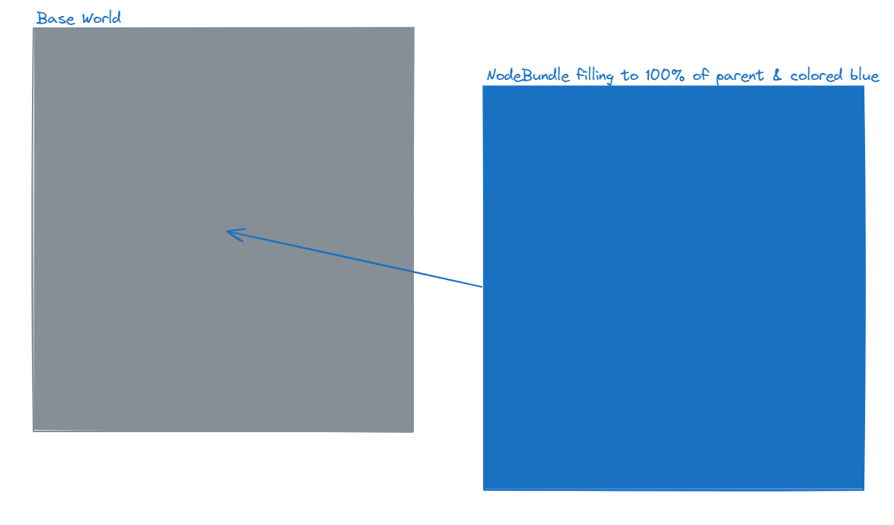

Execute: `cargo run`

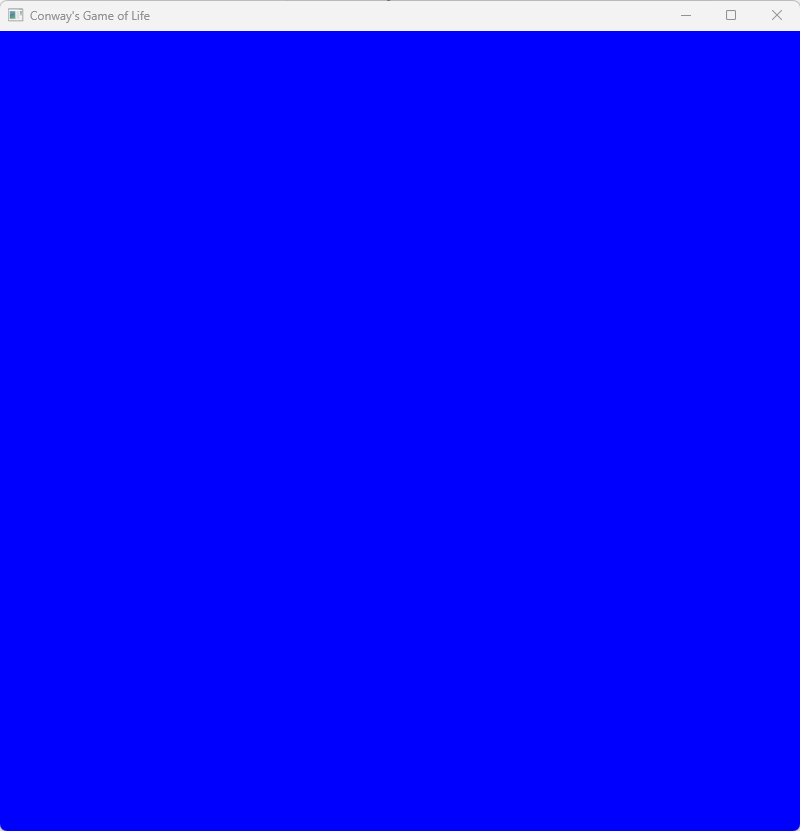

That’s… a lot of blue.

`git commit -a -m "Add camera and background on startup."`

Okay, great, we now have a background! Let’s actually draw some board elements.

For this, we will use bevy’s built in grid system… to know how many rows and columns we’ll need to add access to the board struct. Let’s add it to the method signature of initial_setup.

```rust
fn initial_setup(mut commands: Commands, board: Res<Board>) {
```

However… due to Bevy trait constraints this won’t compile as Board needs the Resource trait, so we will add a derive Resource trait to the Board.

```rust
#[derive(Resource)]
struct Board {
    squares_wide: u16,
    squares_high: u16,
}
```

*Side note:* A resource in Bevy isn’t one of the letters in ECS, but is instead something that’s “globally unique” for the game and can be pulled into any system we need to read or modify the state in. We’ll later add a few more resources and elements to the Board which will be useful in many different systems.

In addition to changing the method signature and traits of the board, we need to add the board resource to be available for Bevy to pull in. For that we need to add the Board resource to our app in the main function. Only one resource of each type can be added to the app/world at a time, so if we constructed a second board and inserted it, bevy would panic.

```rust
//main.rs main function
//Add this line before the add_systems(Startup, initial_setup) call.
    .insert_resource(board)
```

Okay, now we move on to changing our background NodeBundle to be a grid layout. Replace our BEAUTIFUL blue background spawn with one that’s a grid type. Then after the grid is spawned, we will add some child nodes to it.

For this we iterate over the columns and and rows to add each of the squares, alternating the color of the grid node between red and black.

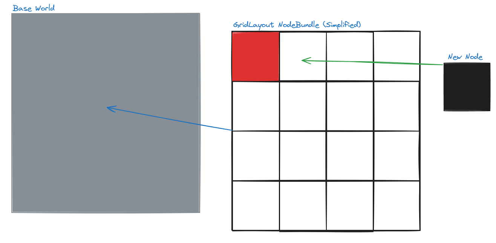


```rust
//main.rs intialize_setup function
//Replace the spawn NodeBundle block
    commands
        .spawn(NodeBundle {
            style: Style {
                // Create a grid layout, at 100% of the parent element
                // Height and width.
                display: Display::Grid,
                width: Val::Percent(100.0),
                height: Val::Percent(100.0),
                grid_template_columns: vec![
                    GridTrack::auto(); usize::from(board.squares_wide)
                ],
                grid_template_rows: vec![
                    GridTrack::auto(); usize::from(board.squares_high)
                ],
                ..default()
            },
            background_color: BackgroundColor(Color::WHITE),
            ..default()
        })
        .with_children(|builder| {
            //Every other will be black or red!
            for c in 0..board.squares_wide {
                for r in 0..board.squares_high {
                    let color = if (r + c) % 2 == 0 {
                        Color::RED
                    } else {
                        Color::BLACK
                    };
                    builder.spawn(NodeBundle {
                        style: Style {
                            display: Display::Grid,
                            ..default()
                        },
                        background_color: BackgroundColor(color),
                        ..default()
                    });
                }
            }
        });
```

Okay, in case anything was lost, here’s a full main.rs

```rust
//main.rs
#![warn(clippy::pedantic)]

use bevy::prelude::*;

//Default for the tile sizes.
const TILE_SIZE: u16 = 40;

#[derive(Resource)]
struct Board {
    squares_wide: u16,
    squares_high: u16,
}

fn main() {
    println!("Bevy app starting!");
    let cols = 20;
    let rows = 20;
    let board = Board {squares_wide: cols, squares_high: rows};
    let window_width = TILE_SIZE * board.squares_wide;
    let window_height =  TILE_SIZE * board.squares_high;
    App::new()
        .add_plugins(
            DefaultPlugins.set(WindowPlugin {
                primary_window: Some(Window {
                    title: "Conway's Game of Life".into(),
                    resolution: (f32::from(window_width), f32::from(window_height)).into(),
                    ..default()
                }),
                ..default()
            })
        )
        .insert_resource(board)
        .add_systems(Startup, initial_setup)
        .run();
}

fn initial_setup(mut commands: Commands, board: Res<Board>) {
    commands.spawn(Camera2dBundle::default());
    //Draw the grid layout!
    commands
        .spawn(NodeBundle {
            style: Style {
                // Create a grid layout, at 100% of the parent element
                // Height and width.
                display: Display::Grid,
                width: Val::Percent(100.0),
                height: Val::Percent(100.0),
                grid_template_columns: vec![
                    GridTrack::auto(); usize::from(board.squares_wide)
                ],
                grid_template_rows: vec![
                    GridTrack::auto(); usize::from(board.squares_high)
                ],
                ..default()
            },
            background_color: BackgroundColor(Color::WHITE),
            ..default()
        })
        .with_children(|builder| {
            //Every other will be black or red!
            for c in 0..board.squares_wide {
                for r in 0..board.squares_high {
                    let color = if (r + c) % 2 == 0 {
                        Color::RED
                    } else {
                        Color::BLACK
                    };
                    builder.spawn(NodeBundle {
                        style: Style {
                            display: Display::Grid,
                            ..default()
                        },
                        background_color: BackgroundColor(color),
                        ..default()
                    });
                }
            }
        });
}
```
Now let’s see what we have by executing: `cargo run`

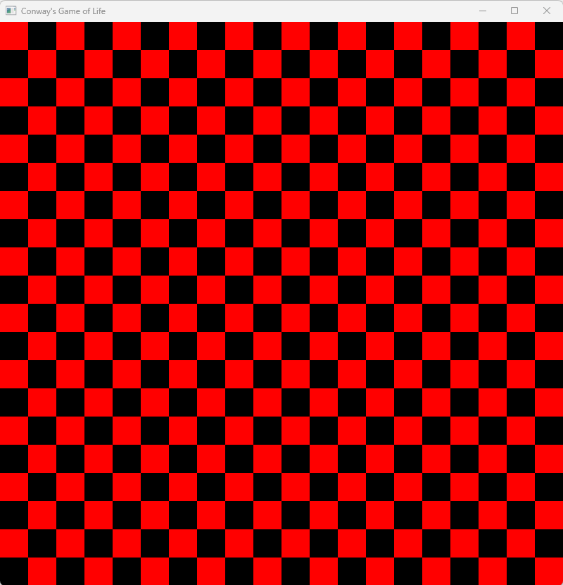

Sweet! Looks like we can play a huge game of checkers on that board!
Let’s commit it to be able to return here as we’re about to change a good amount of stuff!

`git commit -a -m "Checker board view."`

## Consistent Game State

The every other red + black was nice to demonstrate how to draw, but eventually we’ll need to change the colors of the squares based on their alive/dead status, so let’s store the board state in our Board Struct. For this we’ll add a 2d vector to the Board object:

```rust
//main.rs
#[derive(Resource)]
struct Board {
    squares_wide: u16,
    squares_high: u16,
    squares: Vec<Vec<bool>>,
}
```

And we’ll initialize it and pass it into the board constructor.

```rust
//main.rs main function
// After the first println!
    let cols = 20;
    let rows = 20;
    // Create a 2d vector where every other square is on or off.
    // This is equivalent to a nested for loop over cols then row elements.
    let board_state = (0..cols).map(|col| 
            (0..rows).map(|row| 
                (col + row) % 2 == 0)
                .collect())
        .collect();

    let board = Board {squares_wide: cols, squares_high: rows, squares: board_state};
    let window_width = TILE_SIZE * board.squares_wide;
    let window_height =  TILE_SIZE * board.squares_high;

//main.rs intialize_setup function
// within the with_children block, make it use the squares boolean.
            for c in 0..board.squares_wide {
                for r in 0..board.squares_high {
                    let color = if board.squares[usize::from(c)][usize::from(r)] {
                        Color::RED
                    } else {
                        Color::BLACK
                    };
```

Ok, so we added a two dimensional array (vector of vectors) that contain a boolean of the state of the square of alive or dead — We then use that state for knowing what color of square we should spawn.

This allows us to know what state each square is in without needing some deep knowledge of how the colors are rendered.

Let’s commit!

`git commit -a -m "Board now controls alive/dead color."`

## User Mouse Input

Many game engines have complex click handling logic, but fortunately Bevy solves most of this for us — Instead of using a NodeBundle for each RED/BLACK square, we can use a ButtonBundle instead. The way we interact with it is very similar to NodeBundle, but it also has built in support for button presses and mouse hovers. First we’ll migrate to ButtonBundles. We’re also going to use a White/Black color scheme to be more traditional w/ the Game of Life. Feel free to use whatever color scheme you’d like. Black will represent an alive square, and white will represent a dead one.

```rust
//main.rs
//In initial_setup - Replace the child NodeBundle with one for a ButtonBundle.
#[allow(clippy::needless_pass_by_value)]
fn initial_setup(mut commands: Commands, board: Res<Board>) {
    commands.spawn(Camera2dBundle::default());
    //Button style
    let button_style = Style {
        display: Display::Grid,
        justify_content: JustifyContent::Center,
        align_items: AlignItems::Center,
        ..default()
    };
    //Draw the grid layout!
    commands
        .spawn(NodeBundle {
            style: Style {
                // Create a grid layout, at 100% of the parent element
                // Height and width.
                display: Display::Grid,
                width: Val::Percent(100.0),
                height: Val::Percent(100.0),
                grid_template_columns: vec![
                    GridTrack::auto(); usize::from(board.squares_wide)
                ],
                grid_template_rows: vec![
                    GridTrack::auto(); usize::from(board.squares_high)
                ],
                ..default()
            },
            background_color: BackgroundColor(Color::WHITE),
            ..default()
        })
        .with_children(|builder| {
            //Every other will be black or white!
            for c in 0..board.squares_wide {
                for r in 0..board.squares_high {
                    let color = if board.squares[usize::from(c)][usize::from(r)] {
                        Color::BLACK
                    } else {
                        Color::WHITE
                    };
                    builder.spawn(ButtonBundle {
                        style: button_style.clone(),
                        background_color: BackgroundColor(color),
                        ..default()
                    });
                }
            }
        });
}
```

And to handle the mouse clicks (button presses), we’ll need a new system. This system will be executed on each Update event. The update schedule is different from what we’ll use later for game movement, but it’s the best for showing rapid updates for our game-users.

```rust
//main.rs main - Add another system to the app after the initial_setup addition.
        .add_systems(Update, button_system)
//Add to the bottom of the file.
#[allow(clippy::type_complexity)]
fn button_system(mut interaction_query: Query<
    (
        &Interaction,
        &mut BackgroundColor,
    ),
    (Changed<Interaction>, With<Button>),
>) {
    for (interaction, mut color) in &mut interaction_query {
        match *interaction {
            Interaction::Pressed => {
                println!("Button pressed!");
                *color = if color.0.eq(&Color::BLACK) {
                    Color::WHITE
                }
                else {
                    Color::BLACK
                }.into();
            },
            Interaction::Hovered | Interaction::None => {},
        }
    }
}
```

Now, run the app — you can now toggle different squares on and off! Make your own pattern for fun.

Congratulations, we just made an incredibly boring version of MSPaint! 🥳🎉🎉🥳

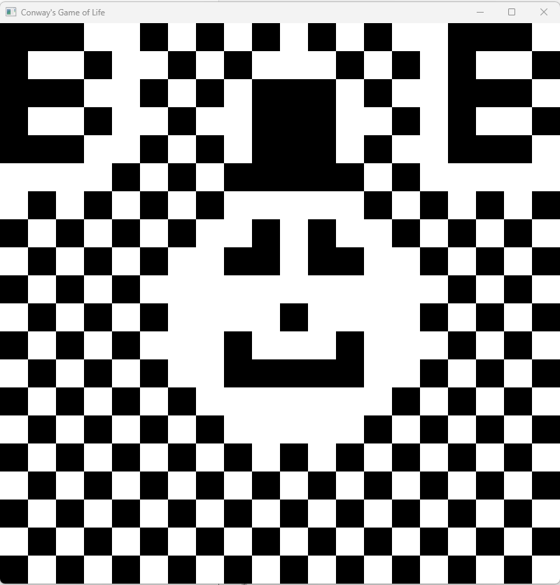

`git commit -a -m "Minimal working square toggle with the mouse."`

Keen observers will start to notice a bit of code smell rising up — We have the Board struct that is supposed to contain the state of the squares, but those true/false combinations no longer match our world when a button is toggled. To do this, we’ll need to change our trusty 2d vector values as well. The reason for the separate game-state array (from the UX elements) might be unclear now, but we’ll round that out in due time. We should strive for one Source of Truth™️ for our states, and here we have strayed from that. Let’s correct it!

At first glance it seems the best place to add it is in that button handler — While that is true, we will need some additional information for that, as when the button is clicked it doesn’t actually “know” where it is in the grid to then map it to the 2d vector coordinates. The good news is we can add the coords to the bundles when we spawn them so when it is clicked we have that information.

Let’s create a new GridLocation Component struct.

```rust
//main.rs
//below the board struct.
#[derive(Component, Debug)]
struct GridLocation {
    row: u16,
    column: u16
}
```

And in initial_setup after our color setting we spawn the ButtonBundle and the GridLocation in a tuple.

```rust
//main.rs initial_setup
//Instead of using the builder to spawn a ButtonBundle, we do it as a tuple with a GridLocation.
//After the color determination, replace the existing spawn.
                    let grid_loc = GridLocation {column: c, row: r};
                    builder.spawn(
                        (ButtonBundle {
                            style: button_style.clone(),
                            background_color: BackgroundColor(color),
                            ..default()
                        }, grid_loc)
                    );
```

This lets us change our button system query to include the grid location. We also need to add a mutable reference to the board as we’re planning to modify the board on a button click.

```rust
//main.rs
#[allow(clippy::type_complexity)]
fn button_system(mut interaction_query: Query<
        (
            &Interaction,
            &mut BackgroundColor,
            &GridLocation
        ),
        (Changed<Interaction>, With<Button>),
    >, mut board: ResMut<Board>) {
    for (interaction, mut color, grid_loc) in &mut interaction_query {
        match *interaction {
            Interaction::Pressed => {
                let r = usize::from(grid_loc.row);
                let c = usize::from(grid_loc.column);
                //Get the game state.
                let cur = board.squares[c][r];
                println!("Button pressed at ({c},{r}) -- Currently:{cur}");

                if cur { //Alive to dead
                    *color = Color::WHITE.into();
                }
                else {
                    *color = Color::BLACK.into();
                }
                board.squares[c][r] = !cur;
            },
            Interaction::Hovered | Interaction::None => {},
        }
    }
}
```

And with that… it looks like we have the same functionality!!! Wait… what?? Why did we do it then? The reason is to have one Source of Truth™️ for our game state — the UX elements could be a place to store this single source, but that mixes the the Game of Life rules with the UX methods we use to display things, which isn’t ideal.

For review, the full main.rs

```rust
//main.rs
#![warn(clippy::pedantic)]

use bevy::prelude::*;

//Default for the tile sizes.
const TILE_SIZE: u16 = 40;

#[derive(Resource)]
struct Board {
    squares_wide: u16,
    squares_high: u16,
    squares: Vec<Vec<bool>>,
}

#[derive(Component, Debug)]
struct GridLocation {
    row: u16,
    column: u16
}

fn main() {
    println!("Bevy app starting!");
    let cols = 20;
    let rows = 20;
    // Create a 2d vector where every other square is on or off.
    // This is equivalent to a nested for loop over cols then row elements.
    let board_state = (0..cols).map(|col| 
        (0..rows).map(|row| 
            (col + row) % 2 == 0)
            .collect())
    .collect();
    let board = Board {squares_wide: cols, squares_high: rows, squares: board_state};
    let window_width = TILE_SIZE * board.squares_wide;
    let window_height =  TILE_SIZE * board.squares_high;
    App::new()
        .add_plugins(
            DefaultPlugins.set(WindowPlugin {
                primary_window: Some(Window {
                    title: "Conway's Game of Life".into(),
                    resolution: (f32::from(window_width), f32::from(window_height)).into(),
                    ..default()
                }),
                ..default()
            })
        )
        .insert_resource(board)
        .add_systems(Startup, initial_setup)
        .add_systems(Update, button_system)
        .run();
}

fn initial_setup(mut commands: Commands, board: Res<Board>) {
    commands.spawn(Camera2dBundle::default());
    //Button style
    let button_style = Style {
        display: Display::Grid,
        justify_content: JustifyContent::Center,
        align_items: AlignItems::Center,
        ..default()
    };
    //Draw the grid layout!
    commands
        .spawn(NodeBundle {
            style: Style {
                // Create a grid layout, at 100% of the parent element
                // Height and width.
                display: Display::Grid,
                width: Val::Percent(100.0),
                height: Val::Percent(100.0),
                grid_template_columns: vec![
                    GridTrack::auto(); usize::from(board.squares_wide)
                ],
                grid_template_rows: vec![
                    GridTrack::auto(); usize::from(board.squares_high)
                ],
                ..default()
            },
            background_color: BackgroundColor(Color::WHITE),
            ..default()
        })
        .with_children(|builder| {
            //Every other will be black or white!
            for c in 0..board.squares_wide {
                for r in 0..board.squares_high {
                    let color = if board.squares[usize::from(c)][usize::from(r)] {
                        Color::BLACK
                    } else {
                        Color::WHITE
                    };
                    let grid_loc = GridLocation {column: c, row: r};
                    builder.spawn(
                        (ButtonBundle {
                            style: button_style.clone(),
                            background_color: BackgroundColor(color),
                            ..default()
                        }, grid_loc)
                    );
                }
            }
        });
}

#[allow(clippy::type_complexity)]
fn button_system(mut interaction_query: Query<
    (
        &Interaction,
        &mut BackgroundColor,
        &GridLocation
    ),
    (Changed<Interaction>, With<Button>),
>, mut board: ResMut<Board>) {
    for (interaction, mut color, grid_loc) in &mut interaction_query {
        match *interaction {
            Interaction::Pressed => {
                let r = usize::from(grid_loc.row);
                let c = usize::from(grid_loc.column);
                //Get the game state.
                let cur = board.squares[c][r];
                println!("Button pressed at ({c},{r}) -- Currently:{cur}");

                if cur { //Alive to dead
                    *color = Color::WHITE.into();
                }
                else {
                    *color = Color::BLACK.into();
                }
                board.squares[c][r] = !cur;
            },
            Interaction::Hovered | Interaction::None => {},
        }
    }
}
```

`git commit -a -m "Use the game board array as the source of a square’s state."`

## Add Game Movement

Toggling buttons back and forth doesn’t exactly constitute a game, so let’s start adding some life to the board — First step on the journey is to toggle the square colors back and forth.

For that, we’ll add a new system which will be executed on a FixedUpdate (time) schedule, not on every Update event. If we were on each Update it would progress *far* too fast to keep track of.

```rust
//main.rs

//below TILE_SIZE
const UPDATE_RATE_SEC: f64 = 0.5;
//main.rs in the main function
// To the app initialization
        .insert_resource(Time::<Fixed>::from_seconds(UPDATE_RATE_SEC))
        .add_systems(FixedUpdate, update_board)
        

//main.rs below button_system
//Update the board for every entity with both a backgroundcolor and a gridlocation.
fn update_board(mut query: Query<(&mut BackgroundColor, &GridLocation)>, mut board: ResMut<Board>) {
    for (mut color, grid_loc) in &mut query {
        let c = usize::from(grid_loc.column);
        let r = usize::from(grid_loc.row);
        let cur = board.squares[c][r];
        // for now, toggle back and forth.
        if cur {
            *color = Color::WHITE.into();
        } else {
            *color = Color::BLACK.into();
        }
        board.squares[c][r] = !cur;
    }
}
```

execute it with `cargo run` You should see the tile colors oscillate every half second -- Houston, we have … movement!

While we can still click to toggle things… it’s not exactly a game... but let’s commit anyways.

`git commit -a -m "Time based toggle of the squares back and forth."`

For fun you can change the FixedUpdate to Update to see the crazy chaos that comes with updating WAY too fast!

## The Game of Life and Death

Let’s add in the game of life rules.

For some background, Conway’s rules are:

```
Any live cell with fewer than two live neighbours dies, as if by underpopulation.
Any live cell with two or three live neighbours lives on to the next generation.
Any live cell with more than three live neighbours dies, as if by overpopulation.
Any dead cell with exactly three live neighbours becomes a live cell, as if by reproduction.
```

To support easier evaluation, let’s create a function to calculate the number of neighbors.

This function checks our 8 (in bounds) neighbors to get an alive neighbor count. We calculate *all* neighbors *before* modifying the board object as if we do the check & set while iterating through, we will inappropriately change the outcome of the yet to be evaluated cells.

```rust
//main.rs below update_board
fn get_alive_neighbor_counts(board: &Board) -> Vec<Vec<usize>> {
    let height = usize::from(board.squares_high);
    let width = usize::from(board.squares_wide);
    let mut neighbor_counts = vec![vec![0; height]; width];
    for (c, row) in neighbor_counts.iter_mut().enumerate() {
        for (r, item) in  row.iter_mut().enumerate() {
            let mut neighbors = 0;
            //Top
            if r > 0 {
                //T/L
                if c > 0 && board.squares[c-1][r-1] {
                    neighbors += 1;
                }
                //T/C
                if board.squares[c][r-1] {
                    neighbors += 1;
                }
                //T/R
                if c+1 < width && board.squares[c+1][r-1] {
                    neighbors += 1;
                }
            }
            //Left
            if c > 0 && board.squares[c-1][r] {
                neighbors += 1;
            }
            //Right
            if c+1 < width && board.squares[c+1][r] {
                neighbors += 1;
            }
            //Bottom
            if r+1 < height {
                //B/L
                if c > 0 && board.squares[c-1][r+1] {
                    neighbors += 1;
                }
                //B/C
                if board.squares[c][r+1] {
                    neighbors += 1;
                }
                //B/R
                if c+1 < width && board.squares[c+1][r+1] {
                    neighbors += 1;
                }
            }
            *item = neighbors;
        }
    }
    neighbor_counts
}
```

Now instead of our boring back and forth we can update the board using these rules!

```rust
//main.rs
//Update the board for every entity with both a backgroundcolor and a gridlocation..=
fn update_board(mut query: Query<(&mut BackgroundColor, &GridLocation)>, mut board: ResMut<Board>) {
    //Fetch the neighbor counts.
    let neighbor_counts = get_alive_neighbor_counts(board.as_ref());
    for (mut color, grid_loc) in &mut query {
        let c = usize::from(grid_loc.column);
        let r = usize::from(grid_loc.row);
        let cur = board.squares[c][r];
        let n = neighbor_counts[c][r];
        let mut new_state = cur;
        if cur {
            // Live cell
            //fewer than two live neighbours dies, as if by underpopulation.
            if n < 2 {
                //Underpop
                new_state = false;
            }
            //two or three live neighbours lives on to the next generation.
            if n == 2 || n == 3 {
                //We live!
                new_state = true;
            }
            //more than three live neighbours dies, as if by overpopulation.
            if n > 3 {
                //Overpop
                new_state = false;
            }
        } else {
            // Dead Cell
            //exactly three live neighbours becomes a live cell, as if by reproduction.
            if n == 3 {
                //breeeed
                new_state = true;
            }
        }
        //Update the data
        board.squares[c][r] = new_state;
        if new_state {
            *color = Color::BLACK.into();
        } else {
            *color = Color::WHITE.into();
        }
    }
}
```

Alright — Execute things with `cargo run`

NICE! Looks like we're movin’! After a while you’ll start to see the checkerboard pattern disappear & likely some patterns begin to stabilize. We can then change it up a bit with the mouse!

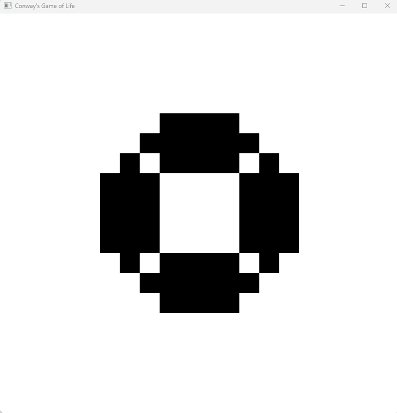

Here’s the full main.rs

```rust
//main.rs
#![warn(clippy::pedantic)]

use bevy::prelude::*;

//Default for the tile sizes.
const TILE_SIZE: u16 = 40;
const UPDATE_RATE_SEC: f64 = 0.5;

#[derive(Resource)]
struct Board {
    squares_wide: u16,
    squares_high: u16,
    squares: Vec<Vec<bool>>,
}

#[derive(Component, Debug)]
struct GridLocation {
    row: u16,
    column: u16
}

fn main() {
    println!("Bevy app starting!");
    let cols = 20;
    let rows = 20;
    // Create a 2d vector where every other square is on or off.
    // This is equivalent to a nested for loop over cols then row elements.
    let board_state = (0..cols).map(|col| 
        (0..rows).map(|row| 
            (col + row) % 2 == 0)
            .collect())
    .collect();
    let board = Board {squares_wide: cols, squares_high: rows, squares: board_state};
    let window_width = TILE_SIZE * board.squares_wide;
    let window_height =  TILE_SIZE * board.squares_high;
    App::new()
        .add_plugins(
            DefaultPlugins.set(WindowPlugin {
                primary_window: Some(Window {
                    title: "Conway's Game of Life".into(),
                    resolution: (f32::from(window_width), f32::from(window_height)).into(),
                    ..default()
                }),
                ..default()
            })
        )
        .insert_resource(board)
        .insert_resource(Time::<Fixed>::from_seconds(UPDATE_RATE_SEC))
        .add_systems(FixedUpdate, update_board)
        .add_systems(Startup, initial_setup)
        .add_systems(Update, button_system)
        .run();
}

fn initial_setup(mut commands: Commands, board: Res<Board>) {
    commands.spawn(Camera2dBundle::default());
    //Button style
    let button_style = Style {
        display: Display::Grid,
        justify_content: JustifyContent::Center,
        align_items: AlignItems::Center,
        ..default()
    };
    //Draw the grid layout!
    commands
        .spawn(NodeBundle {
            style: Style {
                // Create a grid layout, at 100% of the parent element
                // Height and width.
                display: Display::Grid,
                width: Val::Percent(100.0),
                height: Val::Percent(100.0),
                grid_template_columns: vec![
                    GridTrack::auto(); usize::from(board.squares_wide)
                ],
                grid_template_rows: vec![
                    GridTrack::auto(); usize::from(board.squares_high)
                ],
                ..default()
            },
            background_color: BackgroundColor(Color::WHITE),
            ..default()
        })
        .with_children(|builder| {
            //Every other will be black or white!
            for c in 0..board.squares_wide {
                for r in 0..board.squares_high {
                    let color = if board.squares[usize::from(c)][usize::from(r)] {
                        Color::BLACK
                    } else {
                        Color::WHITE
                    };
                    let grid_loc = GridLocation {column: c, row: r};
                    builder.spawn(
                        (ButtonBundle {
                            style: button_style.clone(),
                            background_color: BackgroundColor(color),
                            ..default()
                        }, grid_loc)
                    );
                }
            }
        });
}

#[allow(clippy::type_complexity)]
fn button_system(mut interaction_query: Query<
    (
        &Interaction,
        &mut BackgroundColor,
        &GridLocation
    ),
    (Changed<Interaction>, With<Button>),
>, mut board: ResMut<Board>) {
    for (interaction, mut color, grid_loc) in &mut interaction_query {
        match *interaction {
            Interaction::Pressed => {
                let r = usize::from(grid_loc.row);
                let c = usize::from(grid_loc.column);
                //Get the game state.
                let cur = board.squares[c][r];
                println!("Button pressed at ({c},{r}) -- Currently:{cur}");

                if cur { //Alive to dead
                    *color = Color::WHITE.into();
                }
                else {
                    *color = Color::BLACK.into();
                }
                board.squares[c][r] = !cur;
            },
            Interaction::Hovered | Interaction::None => {},
        }
    }
}

fn update_board(mut query: Query<(&mut BackgroundColor, &GridLocation)>, mut board: ResMut<Board>) {
    //Fetch the neighbor counts.
    let neighbor_counts = get_alive_neighbor_counts(board.as_ref());
    for (mut color, grid_loc) in &mut query {
        let c = usize::from(grid_loc.column);
        let r = usize::from(grid_loc.row);
        let cur = board.squares[c][r];
        let n = neighbor_counts[c][r];
        let mut new_state = cur;
        if cur {
            // Live cell
            //fewer than two live neighbours dies, as if by underpopulation.
            if n < 2 {
                //Underpop
                new_state = false;
            }
            //two or three live neighbours lives on to the next generation.
            if n == 2 || n == 3 {
                //We live!
                new_state = true;
            }
            //more than three live neighbours dies, as if by overpopulation.
            if n > 3 {
                //Overpop
                new_state = false;
            }
        } else {
            // Dead Cell
            //exactly three live neighbours becomes a live cell, as if by reproduction.
            if n == 3 {
                //breeeed
                new_state = true;
            }
        }
        //Update the data
        board.squares[c][r] = new_state;
        if new_state {
            *color = Color::BLACK.into();
        } else {
            *color = Color::WHITE.into();
        }
    }
}

fn get_alive_neighbor_counts(board: &Board) -> Vec<Vec<usize>> {
    let height = usize::from(board.squares_high);
    let width = usize::from(board.squares_wide);
    let mut neighbor_counts = vec![vec![0; height]; width];
    for (c, row) in neighbor_counts.iter_mut().enumerate() {
        for (r, item) in  row.iter_mut().enumerate() {
            let mut neighbors = 0;
            //Top
            if r > 0 {
                //T/L
                if c > 0 && board.squares[c-1][r-1] {
                    neighbors += 1;
                }
                //T/C
                if board.squares[c][r-1] {
                    neighbors += 1;
                }
                //T/R
                if c+1 < width && board.squares[c+1][r-1] {
                    neighbors += 1;
                }
            }
            //Left
            if c > 0 && board.squares[c-1][r] {
                neighbors += 1;
            }
            //Right
            if c+1 < width && board.squares[c+1][r] {
                neighbors += 1;
            }
            //Bottom
            if r+1 < height {
                //B/L
                if c > 0 && board.squares[c-1][r+1] {
                    neighbors += 1;
                }
                //B/C
                if board.squares[c][r+1] {
                    neighbors += 1;
                }
                //B/R
                if c+1 < width && board.squares[c+1][r+1] {
                    neighbors += 1;
                }
            }
            *item = neighbors;
        }
    }
    neighbor_counts
}
```

`git commit -a -m "Implement the game logic for life and death."`

Right on, right on, right on! So we’ve implemented the game logic and can toggle squares on and off *if* we’re fast enough. However… that doesn’t allow for much time — You can see in the gif my frustration that the deaths happened before I could click fast enough to sustain the population!

To allow for more thoughtful setting of the board state, let’s add in the ability to allow the user to pause the game logic so we can take our time creating the patterns.

This will allow the user to create Game of Life shapes like oscillators and gliders!

Below the oscillators are the top 4 items, and there’s a glider below that moves down and to the right.

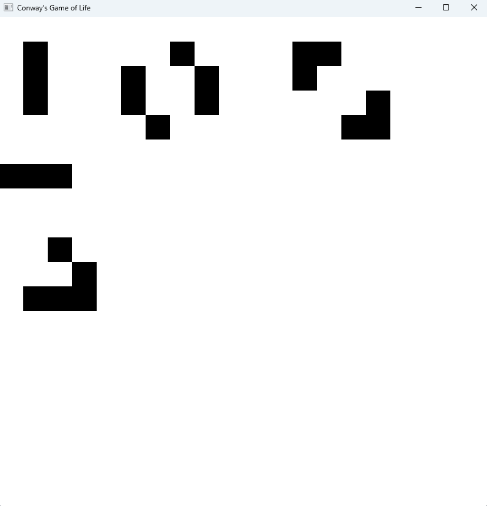

## Taking Keyboard Input + updating GameState.

Ok, so our next goal will be to allow the users to hit the space-bar and pause the game progress such that they can click and make their own patterns with enough time without the life rules kicking in and killing off some poor square too early. For this, we will use the built-in bevy concept of a State. States are built into many features of the Bevy engine and allow us to run or *not* run certain systems depending on the current state.

We’ll create a `GameState` enum, deriving many traits (including States -Required by bevy). We also need to set the default Enum state the game will initially be in when we add the state to the app.

```rust
//main.rs
//Above the Board struct.
#[derive(Debug, Default, Clone, Eq, PartialEq, Hash, States)]
enum GameState {
    #[default]
    Running,
    Paused,
}
```

Then we add the state to the app and we can convert the `update_board` function to be contingent on the Running gamestate.

```rust
//main.rs main function, after the insert_resources statements.
    .add_state::<GameState>()
//Replace the current single FixedUpdate system
    .add_systems(FixedUpdate, update_board.run_if(in_state(GameState::Running)))
```
We then can add a keyboard_system that’s similar in many ways to the button_system. For state management, we will need to modify what state the game will be in next iteration, not the state we’re currently in, so we modify the NextState<GameState> we receive.

```rust
//main.rs
// Below the existing button_system
#[allow(clippy::needless_pass_by_value)]
fn keyboard_system(keyboard_input: Res<Input<KeyCode>>, game_state: Res<State<GameState>>, mut next_game_state: ResMut<NextState<GameState>>) {
    if keyboard_input.just_pressed(KeyCode::Space) {
        match game_state.to_owned() {
            GameState::Running => {
                println!("Pausing");
                next_game_state.set(GameState::Paused);
            },
            GameState::Paused => {
                println!("Running");
                next_game_state.set(GameState::Running);
            },
        }
    }
}
```

Sweet — this keyboard system now will toggle the game between running and paused. The only method currently contingent on **Running** it is the update_board function that runs the game rules.

```rust
//main.rs
// main function, add the keyboard_system on update after button_system
.add_systems(Update, keyboard_system)
```

Now, how about we add in the ability to clear the board when the “C” key is pressed, that way if we want to start fresh, we don’t have to click off all the black squares. Ok, should be easy enough, we already have the keyboard event handler, however we’ll need access to the game board as well.

```rust
//main.rs
#[allow(clippy::needless_pass_by_value)]
fn keyboard_system(keyboard_input: Res<Input<KeyCode>>, game_state: Res<State<GameState>>, mut next_game_state: ResMut<NextState<GameState>>, 
    mut board: ResMut<Board>) {
    if keyboard_input.just_pressed(KeyCode::Space) {
        match game_state.to_owned() {
            GameState::Running => {
                println!("Pausing");
                next_game_state.set(GameState::Paused);
            },
            GameState::Paused => {
                println!("Running");
                next_game_state.set(GameState::Running);
            },
        }
    }
    if keyboard_input.just_pressed(KeyCode::C) {
        println!("Clear");
        for c in 0..usize::from(board.squares_wide) {
            for r in 0..usize::from(board.squares_high) {
                board.squares[c][r] = false;
            }
        }
    }
}
```

If you execute `cargo run` it pauses fine, but there’s some odd behavior with clear — if it’s paused, we need to resume before the clear happens.

Our first reflex to fix this might be to add the same queries on color and grid_loc like we have elsewhere into the keyboard system… but when doing so, we might take a step back and realize we’re doing this whole “update the square color” in an awful lot of places. Let’s pull out the drawing into it’s own system.

```rust
//main.rs
// After update_board
#[allow(clippy::needless_pass_by_value)]
fn draw_board(mut query: Query<(&mut BackgroundColor, &GridLocation)>, board: Res<Board>) {
    for (mut color, grid_loc) in &mut query {
        let alive = board.squares[grid_loc.column][grid_loc.row];
        if alive {
            *color = Color::BLACK.into();
        } else {
            *color = Color::WHITE.into();
        }
    }
}
```

We then should add it in as a system, but we also have two other Update scheduled systems — for this we’ll use a slightly different way to add them in. We’ll use a chained tuple on update as shown here:

```rust
//main.rs main function:
// Remove all add_systems(Update... lines and replace with:
.add_systems(Update, (button_system, keyboard_system, draw_board).chain())
```

Now, this will cause a bit of a different behavior in our system — It will guarantee for the Update scheduled events, that the systems that are in the chained tuple will be executed in the order they are listed, so button, keyboard, then draw. This allows the board to be cleared before the board may be drawn. Out of order in this case isn’t hugely impactful as we would update on the next Update tick, which is rapid, but there are other things later that will benefit from the user input being before the drawing phase.

If you run it now you should see the board clear properly, even if paused.

Before we commit we should also remove the other spots we currently set the UX color (like in update_board). This will also allow us to prune some method parameters.

Updated update_board

```rust
fn update_board(mut query: Query<&GridLocation>, mut board: ResMut<Board>) {
    //Fetch the neighbor counts.
    let neighbor_counts = get_alive_neighbor_counts(board.as_ref());
    for grid_loc in &mut query {
        let c = usize::from(grid_loc.column);
        let r = usize::from(grid_loc.row);
        let cur = board.squares[c][r];
        let n = neighbor_counts[c][r];
        let mut new_state = cur;
        if cur {
            // Live cell
            //fewer than two live neighbours dies, as if by underpopulation.
            if n < 2 {
                //Underpop
                new_state = false;
            }
            //two or three live neighbours lives on to the next generation.
            if n == 2 || n == 3 {
                //We live!
                new_state = true;
            }
            //more than three live neighbours dies, as if by overpopulation.
            if n > 3 {
                //Overpop
                new_state = false;
            }
        } else {
            // Dead Cell
            //exactly three live neighbours becomes a live cell, as if by reproduction.
            if n == 3 {
                //breeeed
                new_state = true;
            }
        }
        //Update the data
        board.squares[c][r] = new_state;
    }
}
```
Updated button_system:

```rust
#[allow(clippy::type_complexity)]
fn button_system(mut interaction_query: Query<
    (
        &Interaction,
        &GridLocation,
    ),
    (Changed<Interaction>, With<Button>),
>, mut board: ResMut<Board>) {
    for (interaction, grid_loc) in &mut interaction_query {
        match *interaction {
            Interaction::Pressed => {
                let r = usize::from(grid_loc.row);
                let c = usize::from(grid_loc.column);
                //Get the game state.
                let cur = board.squares[c][r];
                println!("Button pressed at ({c},{r}) -- Currently:{cur}");
                board.squares[c][r] = !cur;
            },
            Interaction::Hovered | Interaction::None => {},
        }
    }
}
```

A major strength of ECS is that is allows this type of separation of components from each other. The above is a concrete example where we can prune any care about UX from the `keyboard_system`, `mouse_system`, and `update_board` functions but still maintain the same functionality. This is useful if we wanted to add some feature where perhaps we want to only draw a subset of the screen, or change the UX experience to something like a [ratatui](https://github.com/ratatui-org/ratatui) console and the code changes may only be required in the draw_board function.

Alright — lots of updates, here’s the full main.rs

```rust
//main.rs
#![warn(clippy::pedantic)]

use bevy::prelude::*;

//Default for the tile sizes.
const TILE_SIZE: u16 = 40;
const UPDATE_RATE_SEC: f64 = 0.5;

#[derive(Debug, Default, Clone, Eq, PartialEq, Hash, States)]
enum GameState {
    #[default]
    Running,
    Paused,
}

#[derive(Resource)]
struct Board {
    squares_wide: u16,
    squares_high: u16,
    squares: Vec<Vec<bool>>,
}

#[derive(Component, Debug)]
struct GridLocation {
    row: u16,
    column: u16
}

fn main() {
    println!("Bevy app starting!");
    let cols = 20;
    let rows = 20;
    // Create a 2d vector where every other square is on or off.
    // This is equivalent to a nested for loop over cols then row elements.
    let board_state = (0..cols).map(|col| 
        (0..rows).map(|row| 
            (col + row) % 2 == 0)
            .collect())
    .collect();
    let board = Board {squares_wide: cols, squares_high: rows, squares: board_state};
    let window_width = TILE_SIZE * board.squares_wide;
    let window_height =  TILE_SIZE * board.squares_high;
    App::new()
        .add_plugins(
            DefaultPlugins.set(WindowPlugin {
                primary_window: Some(Window {
                    title: "Conway's Game of Life".into(),
                    resolution: (f32::from(window_width), f32::from(window_height)).into(),
                    ..default()
                }),
                ..default()
            })
        )
        .insert_resource(board)
        .insert_resource(Time::<Fixed>::from_seconds(UPDATE_RATE_SEC))
        .add_state::<GameState>()
        .add_systems(FixedUpdate, update_board.run_if(in_state(GameState::Running)))
        .add_systems(Startup, initial_setup)
        .add_systems(Update, (button_system, keyboard_system, draw_board).chain())
        .run();
}

#[allow(clippy::needless_pass_by_value)]
fn initial_setup(mut commands: Commands, board: Res<Board>) {
    commands.spawn(Camera2dBundle::default());
    //Button style
    let button_style = Style {
        display: Display::Grid,
        justify_content: JustifyContent::Center,
        align_items: AlignItems::Center,
        ..default()
    };
    //Draw the grid layout!
    commands
        .spawn(NodeBundle {
            style: Style {
                // Create a grid layout, at 100% of the parent element
                // Height and width.
                display: Display::Grid,
                width: Val::Percent(100.0),
                height: Val::Percent(100.0),
                grid_template_columns: vec![
                    GridTrack::auto(); usize::from(board.squares_wide)
                ],
                grid_template_rows: vec![
                    GridTrack::auto(); usize::from(board.squares_high)
                ],
                ..default()
            },
            background_color: BackgroundColor(Color::WHITE),
            ..default()
        })
        .with_children(|builder| {
            //Every other will be black or white!
            for c in 0..board.squares_wide {
                for r in 0..board.squares_high {
                    let color = if board.squares[usize::from(c)][usize::from(r)] {
                        Color::BLACK
                    } else {
                        Color::WHITE
                    };
                    let grid_loc = GridLocation {column: c, row: r};
                    builder.spawn(
                        (ButtonBundle {
                            style: button_style.clone(),
                            background_color: BackgroundColor(color),
                            ..default()
                        }, grid_loc)
                    );
                }
            }
        });
}

#[allow(clippy::type_complexity)]
fn button_system(mut interaction_query: Query<
    (
        &Interaction,
        &GridLocation,
    ),
    (Changed<Interaction>, With<Button>),
>, mut board: ResMut<Board>) {
    for (interaction, grid_loc) in &mut interaction_query {
        match *interaction {
            Interaction::Pressed => {
                let r = usize::from(grid_loc.row);
                let c = usize::from(grid_loc.column);
                //Get the game state.
                let cur = board.squares[c][r];
                println!("Button pressed at ({c},{r}) -- Currently:{cur}");
                board.squares[c][r] = !cur;
            },
            Interaction::Hovered | Interaction::None => {},
        }
    }
}

#[allow(clippy::needless_pass_by_value)]
fn keyboard_system(keyboard_input: Res<Input<KeyCode>>, game_state: Res<State<GameState>>, mut next_game_state: ResMut<NextState<GameState>>, 
    mut board: ResMut<Board>) {
    if keyboard_input.just_pressed(KeyCode::Space) {
        match game_state.to_owned() {
            GameState::Running => {
                println!("Pausing");
                next_game_state.set(GameState::Paused);
            },
            GameState::Paused => {
                println!("Running");
                next_game_state.set(GameState::Running);
            },
        }
    }
    if keyboard_input.just_pressed(KeyCode::C) {
        println!("Clear");
        for c in 0..usize::from(board.squares_wide) {
            for r in 0..usize::from(board.squares_high) {
                board.squares[c][r] = false;
            }
        }
    }
}

fn update_board(mut query: Query<&GridLocation>, mut board: ResMut<Board>) {
    //Fetch the neighbor counts.
    let neighbor_counts = get_alive_neighbor_counts(board.as_ref());
    for grid_loc in &mut query {
        let c = usize::from(grid_loc.column);
        let r = usize::from(grid_loc.row);
        let cur = board.squares[c][r];
        let n = neighbor_counts[c][r];
        let mut new_state = cur;
        if cur {
            // Live cell
            //fewer than two live neighbours dies, as if by underpopulation.
            if n < 2 {
                //Underpop
                new_state = false;
            }
            //two or three live neighbours lives on to the next generation.
            if n == 2 || n == 3 {
                //We live!
                new_state = true;
            }
            //more than three live neighbours dies, as if by overpopulation.
            if n > 3 {
                //Overpop
                new_state = false;
            }
        } else {
            // Dead Cell
            //exactly three live neighbours becomes a live cell, as if by reproduction.
            if n == 3 {
                //breeeed
                new_state = true;
            }
        }
        //Update the data
        board.squares[c][r] = new_state;
    }
}

#[allow(clippy::needless_pass_by_value)]
fn draw_board(mut query: Query<(&mut BackgroundColor, &GridLocation)>, board: Res<Board>) {
    for (mut color, grid_loc) in &mut query {
        let alive = board.squares[usize::from(grid_loc.column)][usize::from(grid_loc.row)];
        if alive {
            *color = Color::BLACK.into();
        } else {
            *color = Color::WHITE.into();
        }
    }
}

fn get_alive_neighbor_counts(board: &Board) -> Vec<Vec<usize>> {
    let height = usize::from(board.squares_high);
    let width = usize::from(board.squares_wide);
    let mut neighbor_counts = vec![vec![0; height]; width];
    for (c, row) in neighbor_counts.iter_mut().enumerate() {
        for (r, item) in  row.iter_mut().enumerate() {
            let mut neighbors = 0;
            //Top
            if r > 0 {
                //T/L
                if c > 0 && board.squares[c-1][r-1] {
                    neighbors += 1;
                }
                //T/C
                if board.squares[c][r-1] {
                    neighbors += 1;
                }
                //T/R
                if c+1 < width && board.squares[c+1][r-1] {
                    neighbors += 1;
                }
            }
            //Left
            if c > 0 && board.squares[c-1][r] {
                neighbors += 1;
            }
            //Right
            if c+1 < width && board.squares[c+1][r] {
                neighbors += 1;
            }
            //Bottom
            if r+1 < height {
                //B/L
                if c > 0 && board.squares[c-1][r+1] {
                    neighbors += 1;
                }
                //B/C
                if board.squares[c][r+1] {
                    neighbors += 1;
                }
                //B/R
                if c+1 < width && board.squares[c+1][r+1] {
                    neighbors += 1;
                }
            }
            *item = neighbors;
        }
    }
    neighbor_counts
}
```

Let’s commit for good measure!

`git commit -a -m “Add ability to pause/resume and clear the board. Refactor the UX setting to be contained in the draw_board function.”`

## Iteration counter display

Next it’d be nice to display a few pieces of info about the game status, like the number of alive or dead squares and the number of iterations since the last start/clear.

For this we will add additional information into the board resource, and one that represents the current game iteration count. In addition we’ll add some no-member structs we’ll use later when spawning our new text areas.

```rust
//main.rs
//Add alive_squares to the Board.
#[derive(Resource)]
struct Board {
    squares_wide: u16,
    squares_high: u16,
    squares: Vec<Vec<bool>>,
    alive_squares: usize,
}

//Add a new iterations counter to a GameMetadata below board.
#[derive(Resource, Default)]
struct GameMetadata {
    iterations: usize
}

#[derive(Component)]
struct IterationText;

#[derive(Component)]
struct GameStateText;

//main.rs main function
// Add the alive_squares to be 1/2 of the cols * rows.
let board = Board {squares_wide: cols, squares_high: rows, squares: board_state, alive_squares: usize::from(cols) * usize::from(rows) / 2};
let game_metadata = GameMetadata::default();
// Add game_metadata after the board insertion.
.insert_resource(game_metadata)
```

Next we’ll add a new UX element for a status bar at the bottom of the game.

In the area we already declared some of the consts, add a pixel height for the status bar and we'll also add that padding to the window height.

```rust
//main.rs
// Below TITLE_SIZE
const STATUS_BAR_PX: f32 = 40.0;

// In the main function, change the window_height variable to also include the STATUS_BAR_PX
let window_width = f32::from(TILE_SIZE * board.squares_wide);
let window_height =  f32::from(TILE_SIZE * board.squares_high) + STATUS_BAR_PX;
// Update the resolution aspect of the window setting to no longer require f32::from
resolution: (window_width, window_height).into(),
```

Previously our game grid layout was added to the base world at 100% height and width, now we need to add an additional status bar below the game grid, so we’ll add another layer of grid layout, this time with one column and two rows. In addition, we will use a fixed size for the status bar row, and configure the game grid row to take up all the remaining space (base height *minus* the fixed number of pixels).

Here’s a high level view of what we’re going to change to.

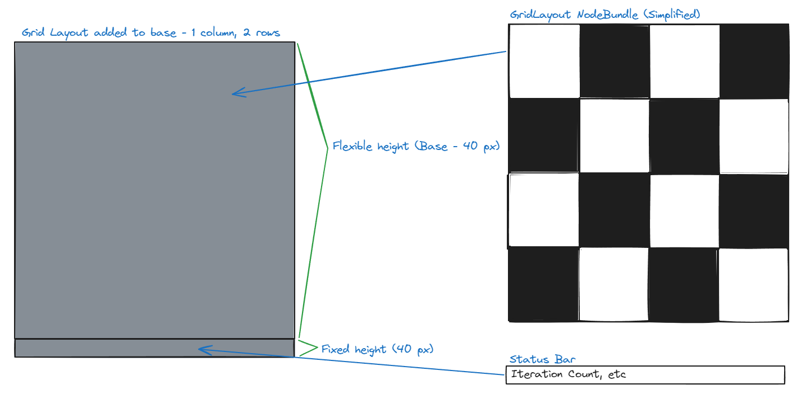

First thing we spawn will be the one column, two row grid layout.

```rust
//main.rs
//Update initial_setup method signature to also take in the GameMetadata.
#[allow(clippy::needless_pass_by_value)]
fn initial_setup(mut commands: Commands, board: Res<Board>, metadata: ResMut<GameMetadata>) {
//<...>
// replace the spawn of the prior game grid layout.
    commands
        .spawn(NodeBundle {
            style: Style {
                //Create a grid layout,
                display: Display::Grid,
                width: Val::Percent(100.0),
                height: Val::Percent(100.0),
                grid_template_columns: vec![
                    GridTrack::auto()
                ],
                //Top Row will take up all the space after the bottom row is complete.
                grid_template_rows: vec![
                    GridTrack::flex(1.0), GridTrack::px(STATUS_BAR_PX)
                ],
                ..default()
            },
            background_color: BackgroundColor(Color::WHITE),
            ..default()
        })
```

This grid layout we just added fills 100% of the base and with `GridTrack::px` we add a fixed element size for the bottom row.

We then use this to add children to it, which will be the grid layout like before, and a new status bar item with some tuples of TextBundles as well as the components we created above.

The two new TextBundles will represent the game state (paused, etc) and the iteration count + alive square counts.

```rust
//main.rs
//initial_setup below the new gridlayout.
        .with_children(|builder| {
            //Game Area
            builder.spawn(NodeBundle {
                style: Style {
                    //Create a grid layout,
                    display: Display::Grid,
                    width: Val::Percent(100.0),
                    height: Val::Percent(100.0),
                    grid_template_columns: vec![
                        GridTrack::auto(); usize::from(board.squares_wide)
                    ],
                    grid_template_rows: vec![
                        GridTrack::auto(); usize::from(board.squares_high)
                    ],
                    ..default()
                },
                background_color: BackgroundColor(Color::WHITE),
                ..default()
            })
            .with_children(|game_area_builder| {
                //Every other will be black or white!
                for c in 0..board.squares_wide {
                    for r in 0..board.squares_high {
                        //Set the color based on the board state.
                        let color = if board.squares[usize::from(c)][usize::from(r)] {
                            Color::BLACK
                        } else {
                            Color::WHITE
                        };
                        let grid_loc = GridLocation {column: c, row: r};
                        game_area_builder.spawn(
                            (ButtonBundle {
                                style: button_style.clone(),
                                background_color: BackgroundColor(color),
                                ..default()
                            }, grid_loc)
                        );
                    }
                }
            });
            //Status Tray
            builder.spawn(NodeBundle {
                style: Style {
                    display: Display::Grid,
                    padding: UiRect::all(Val::Px(6.0)),
                    grid_template_rows: vec![
                        GridTrack::auto()
                    ],
                    //Left slot, right slot.
                    grid_template_columns: vec![
                        GridTrack::auto(), GridTrack::auto()
                    ],
                    ..default()
                },
                ..default()
            })
            .with_children(|tray_builder| {
                tray_builder.spawn((TextBundle::from_section(
                    "Running: [space] to pause, [c] to clear.",
                    TextStyle {
                        font: Handle::default(),
                        font_size: 20.0,
                        color: Color::BLACK,
                    },
                ), GameStateText));
                tray_builder.spawn((TextBundle::from_section(
                    format!("Iter:{}; Alive:{}", metadata.iterations, board.alive_squares),
                    TextStyle {
                        font: Handle::default(),
                        font_size: 20.0,
                        color: Color::BLACK,
                    },
                ).with_text_alignment(TextAlignment::Right), IterationText));
            });
        });
```

The reason we added the new IterationText and StatusText components is so we can query for these specific text fields when we want to update their values after the game is paused or an iteration tick occurred.  To do the text update we’ll add a new system. This new system queries for any Text element with IterationText associated to modify the text on iteration update.

For the `status_bar_text_update` we require the two Text entities as the query params, one for the GameStateText and the other for IterationText. If we just add two different query params Bevy will prevent it w/ a runtime panic. This is because Bevy has no guarantee we didn’t create entities that may share a Component. IE: If we has added both GameStateText and IterationText we would have two mutable references to the same variable which would violate the guarantees of safe rust.

The solution to this is the [ParamSet](https://docs.rs/bevy/latest/bevy/prelude/struct.ParamSet.html) which uses parameter numbering and the borrow checker to ensure we only have a mutable reference to one of the parameters at a time. There are some pretty good examples and explanations in the [ParamSet](https://docs.rs/bevy/latest/bevy/prelude/struct.ParamSet.html) docs.

```rust
//main.rs
// Below the keyboard system
#[allow(clippy::type_complexity, clippy::needless_pass_by_value)]
fn status_bar_text_update(mut text_params: ParamSet<(Query<&mut Text, With<GameStateText>>, Query<&mut Text, With<IterationText>>)>, board: Res<Board>,
    metadata: Res<GameMetadata>, game_state: Res<State<GameState>>) {
    let mut game_state_query = text_params.p0();
    match game_state.to_owned() {
        GameState::Running => {
            game_state_query.single_mut().sections[0].value = "Running: [space] to pause, [c] to clear.".to_string();
        },
        GameState::Paused => {
            game_state_query.single_mut().sections[0].value = "Paused: [space] to resume, [c] to clear, [n] for next.".to_string();
        },
    }
    let mut iter_state_query = text_params.p1();
    let new_text = format!("Iter:{}; Alive:{}", metadata.iterations, board.alive_squares);
    iter_state_query.single_mut().sections[0].value = new_text;
}
// in main() where the systems are intitialized, update the Update system addition
.add_systems(Update, (button_system, keyboard_system, draw_board, status_bar_text_update).chain())
```


We also have to change the square count and increment the iteration counter in both `update_board`, the `keyboard_system`, and `button_system` functions.

```rust
//main.rs
// Add the new metadata resource to update_board.
// Count up the alive squares and increment the iterations.
fn update_board(mut query: Query<&GridLocation>, mut board: ResMut<Board>, mut metadata: ResMut<GameMetadata>) {
    //Fetch the neighbor counts.
    let neighbor_counts = get_alive_neighbor_counts(board.as_ref());
    let mut alive_count = 0;
    for grid_loc in &mut query {
        let c = usize::from(grid_loc.column);
        let r = usize::from(grid_loc.row);
        let cur = board.squares[c][r];
        let n = neighbor_counts[c][r];
        let mut new_state = cur;
        if cur {
            // Live cell
            //fewer than two live neighbours dies, as if by underpopulation.
            if n < 2 {
                //Underpop
                new_state = false;
            }
            //two or three live neighbours lives on to the next generation.
            if n == 2 || n == 3 {
                //We live!
                new_state = true;
            }
            //more than three live neighbours dies, as if by overpopulation.
            if n > 3 {
                //Overpop
                new_state = false;
            }
        } else {
            // Dead Cell
            //exactly three live neighbours becomes a live cell, as if by reproduction.
            if n == 3 {
                //breeeed
                new_state = true;
            }
        }
        if new_state {
            alive_count += 1;
        }
        //Update the data
        board.squares[c][r] = new_state;
    }
    board.alive_squares = alive_count;
    metadata.iterations += 1;
}

//Modify the button system to mod the alive count
#[allow(clippy::type_complexity)]
fn button_system(mut interaction_query: Query<
    (
        &Interaction,
        &GridLocation,
    ),
    (Changed<Interaction>, With<Button>),
>, mut board: ResMut<Board>) {
    for (interaction, grid_loc) in &mut interaction_query {
        match *interaction {
            Interaction::Pressed => {
                let r = usize::from(grid_loc.row);
                let c = usize::from(grid_loc.column);
                //Get the game state.
                let cur = board.squares[c][r];
                if cur {
                    board.alive_squares -= 1;
                } else {
                    board.alive_squares += 1;
                }
                println!("Button pressed at ({c},{r}) -- Currently:{cur}");
                board.squares[c][r] = !cur;
            },
            Interaction::Hovered | Interaction::None => {},
        }
    }
}

//And the keyboard_system to zero the alive_squares on clear.
#[allow(clippy::needless_pass_by_value)]
fn keyboard_system(keyboard_input: Res<Input<KeyCode>>, game_state: Res<State<GameState>>, mut next_game_state: ResMut<NextState<GameState>>, 
    mut board: ResMut<Board>) {
    if keyboard_input.just_pressed(KeyCode::Space) {
        match game_state.to_owned() {
            GameState::Running => {
                println!("Pausing");
                next_game_state.set(GameState::Paused);
            },
            GameState::Paused => {
                println!("Running");
                next_game_state.set(GameState::Running);
            },
        }
    }
    if keyboard_input.just_pressed(KeyCode::C) {
        println!("Clear");
        for c in 0..usize::from(board.squares_wide) {
            for r in 0..usize::from(board.squares_high) {
                board.squares[c][r] = false;
            }
        }
        board.alive_squares = 0;
    }
}
```

Okay now, lots of additions scattered everywhere on that one, let’s do another full main.rs

```rust
//main.rs
#![warn(clippy::pedantic)]

use bevy::prelude::*;

//Default for the tile sizes.
const TILE_SIZE: u16 = 40;
const STATUS_BAR_PX: f32 = 40.0;
const UPDATE_RATE_SEC: f64 = 0.5;

#[derive(Debug, Default, Clone, Eq, PartialEq, Hash, States)]
enum GameState {
    #[default]
    Running,
    Paused,
}

#[derive(Resource)]
struct Board {
    squares_wide: u16,
    squares_high: u16,
    squares: Vec<Vec<bool>>,
    alive_squares: usize,
}

#[derive(Resource, Default)]
struct GameMetadata {
    iterations: usize
}

#[derive(Component)]
struct IterationText;

#[derive(Component)]
struct GameStateText;

#[derive(Component, Debug)]
struct GridLocation {
    row: u16,
    column: u16
}

fn main() {
    println!("Bevy app starting!");
    let cols = 20;
    let rows = 20;
    // Create a 2d vector where every other square is on or off.
    // This is equivalent to a nested for loop over cols then row elements.
    let board_state = (0..cols).map(|col| 
        (0..rows).map(|row| 
            (col + row) % 2 == 0)
            .collect())
    .collect();
    let board = Board {squares_wide: cols, squares_high: rows, squares: board_state, alive_squares: usize::from(cols) * usize::from(rows) / 2};
    let game_metadata = GameMetadata::default();
    let window_width = f32::from(TILE_SIZE * board.squares_wide);
    let window_height =  f32::from(TILE_SIZE * board.squares_high) + STATUS_BAR_PX;
    App::new()
        .add_plugins(
            DefaultPlugins.set(WindowPlugin {
                primary_window: Some(Window {
                    title: "Conway's Game of Life".into(),
                    resolution: (window_width, window_height).into(),
                    ..default()
                }),
                ..default()
            })
        )
        .insert_resource(board)
        .insert_resource(game_metadata)
        .insert_resource(Time::<Fixed>::from_seconds(UPDATE_RATE_SEC))
        .add_state::<GameState>()
        .add_systems(FixedUpdate, update_board.run_if(in_state(GameState::Running)))
        .add_systems(Startup, initial_setup)
        .add_systems(Update, (button_system, keyboard_system, draw_board, status_bar_text_update).chain())
        .run();
}

#[allow(clippy::needless_pass_by_value)]
fn initial_setup(mut commands: Commands, board: Res<Board>, metadata: ResMut<GameMetadata>) {
    commands.spawn(Camera2dBundle::default());
    //Button style
    let button_style = Style {
        display: Display::Grid,
        justify_content: JustifyContent::Center,
        align_items: AlignItems::Center,
        ..default()
    };
    //Draw the grid layout!
    commands
        .spawn(NodeBundle {
            style: Style {
                //Create a grid layout,
                display: Display::Grid,
                width: Val::Percent(100.0),
                height: Val::Percent(100.0),
                grid_template_columns: vec![
                    GridTrack::auto()
                ],
                //Top Row will take up all the space after the bottom row is complete.
                grid_template_rows: vec![
                    GridTrack::flex(1.0), GridTrack::px(STATUS_BAR_PX)
                ],
                ..default()
            },
            background_color: BackgroundColor(Color::WHITE),
            ..default()
        })
        .with_children(|builder| {
            //Game Area
            builder.spawn(NodeBundle {
                style: Style {
                    //Create a grid layout,
                    display: Display::Grid,
                    width: Val::Percent(100.0),
                    height: Val::Percent(100.0),
                    grid_template_columns: vec![
                        GridTrack::auto(); usize::from(board.squares_wide)
                    ],
                    grid_template_rows: vec![
                        GridTrack::auto(); usize::from(board.squares_high)
                    ],
                    ..default()
                },
                background_color: BackgroundColor(Color::WHITE),
                ..default()
            })
            .with_children(|game_area_builder| {
                //Every other will be black or white!
                for c in 0..board.squares_wide {
                    for r in 0..board.squares_high {
                        //Set the color based on the board state.
                        let color = if board.squares[usize::from(c)][usize::from(r)] {
                            Color::BLACK
                        } else {
                            Color::WHITE
                        };
                        let grid_loc = GridLocation {column: c, row: r};
                        game_area_builder.spawn(
                            (ButtonBundle {
                                style: button_style.clone(),
                                background_color: BackgroundColor(color),
                                ..default()
                            }, grid_loc)
                        );
                    }
                }
            });
            //Status Tray
            builder.spawn(NodeBundle {
                style: Style {
                    display: Display::Grid,
                    padding: UiRect::all(Val::Px(6.0)),
                    grid_template_rows: vec![
                        GridTrack::auto()
                    ],
                    //Left slot, right slot.
                    grid_template_columns: vec![
                        GridTrack::auto(), GridTrack::auto()
                    ],
                    ..default()
                },
                ..default()
            })
            .with_children(|tray_builder| {
                tray_builder.spawn((TextBundle::from_section(
                    "Running: [space] to pause, [c] to clear.",
                    TextStyle {
                        font: Handle::default(),
                        font_size: 20.0,
                        color: Color::BLACK,
                    },
                ), GameStateText));
                tray_builder.spawn((TextBundle::from_section(
                    format!("Iter:{}; Alive:{}", metadata.iterations, board.alive_squares),
                    TextStyle {
                        font: Handle::default(),
                        font_size: 20.0,
                        color: Color::BLACK,
                    },
                ).with_text_alignment(TextAlignment::Right), IterationText));
            });
        });
}

#[allow(clippy::type_complexity)]
fn button_system(mut interaction_query: Query<
    (
        &Interaction,
        &GridLocation,
    ),
    (Changed<Interaction>, With<Button>),
>, mut board: ResMut<Board>) {
    for (interaction, grid_loc) in &mut interaction_query {
        match *interaction {
            Interaction::Pressed => {
                let r = usize::from(grid_loc.row);
                let c = usize::from(grid_loc.column);
                //Get the game state.
                let cur = board.squares[c][r];
                if cur {
                    board.alive_squares -= 1;
                } else {
                    board.alive_squares += 1;
                }
                println!("Button pressed at ({c},{r}) -- Currently:{cur}");
                board.squares[c][r] = !cur;
            },
            Interaction::Hovered | Interaction::None => {},
        }
    }
}

#[allow(clippy::needless_pass_by_value)]
fn keyboard_system(keyboard_input: Res<Input<KeyCode>>, game_state: Res<State<GameState>>, mut next_game_state: ResMut<NextState<GameState>>, 
    mut board: ResMut<Board>) {
    if keyboard_input.just_pressed(KeyCode::Space) {
        match game_state.to_owned() {
            GameState::Running => {
                println!("Pausing");
                next_game_state.set(GameState::Paused);
            },
            GameState::Paused => {
                println!("Running");
                next_game_state.set(GameState::Running);
            },
        }
    }
    if keyboard_input.just_pressed(KeyCode::C) {
        println!("Clear");
        for c in 0..usize::from(board.squares_wide) {
            for r in 0..usize::from(board.squares_high) {
                board.squares[c][r] = false;
            }
        }
        board.alive_squares = 0;
    }
}

#[allow(clippy::type_complexity, clippy::needless_pass_by_value)]
fn status_bar_text_update(mut text_params: ParamSet<(Query<&mut Text, With<GameStateText>>, Query<&mut Text, With<IterationText>>)>, board: Res<Board>,
    metadata: Res<GameMetadata>, game_state: Res<State<GameState>>) {
    let mut game_state_query = text_params.p0();
    match game_state.to_owned() {
        GameState::Running => {
            game_state_query.single_mut().sections[0].value = "Running: [space] to pause, [c] to clear.".to_string();
        },
        GameState::Paused => {
            game_state_query.single_mut().sections[0].value = "Paused: [space] to resume, [c] to clear, [n] for next.".to_string();
        },
    }
    let mut iter_state_query = text_params.p1();
    let new_text = format!("Iter:{}; Alive:{}", metadata.iterations, board.alive_squares);
    iter_state_query.single_mut().sections[0].value = new_text;
}

fn update_board(mut query: Query<&GridLocation>, mut board: ResMut<Board>, mut metadata: ResMut<GameMetadata>) {
    //Fetch the neighbor counts.
    let neighbor_counts = get_alive_neighbor_counts(board.as_ref());
    let mut alive_count = 0;
    for grid_loc in &mut query {
        let c = usize::from(grid_loc.column);
        let r = usize::from(grid_loc.row);
        let cur = board.squares[c][r];
        let n = neighbor_counts[c][r];
        let mut new_state = cur;
        if cur {
            // Live cell
            //fewer than two live neighbours dies, as if by underpopulation.
            if n < 2 {
                //Underpop
                new_state = false;
            }
            //two or three live neighbours lives on to the next generation.
            if n == 2 || n == 3 {
                //We live!
                new_state = true;
            }
            //more than three live neighbours dies, as if by overpopulation.
            if n > 3 {
                //Overpop
                new_state = false;
            }
        } else {
            // Dead Cell
            //exactly three live neighbours becomes a live cell, as if by reproduction.
            if n == 3 {
                //breeeed
                new_state = true;
            }
        }
        if new_state {
            alive_count += 1;
        }
        //Update the data
        board.squares[c][r] = new_state;
    }
    board.alive_squares = alive_count;
    metadata.iterations += 1;
}

#[allow(clippy::needless_pass_by_value)]
fn draw_board(mut query: Query<(&mut BackgroundColor, &GridLocation)>, board: Res<Board>) {
    for (mut color, grid_loc) in &mut query {
        let alive = board.squares[usize::from(grid_loc.column)][usize::from(grid_loc.row)];
        if alive {
            *color = Color::BLACK.into();
        } else {
            *color = Color::WHITE.into();
        }
    }
}

fn get_alive_neighbor_counts(board: &Board) -> Vec<Vec<usize>> {
    let height = usize::from(board.squares_high);
    let width = usize::from(board.squares_wide);
    let mut neighbor_counts = vec![vec![0; height]; width];
    for (c, row) in neighbor_counts.iter_mut().enumerate() {
        for (r, item) in  row.iter_mut().enumerate() {
            let mut neighbors = 0;
            //Top
            if r > 0 {
                //T/L
                if c > 0 && board.squares[c-1][r-1] {
                    neighbors += 1;
                }
                //T/C
                if board.squares[c][r-1] {
                    neighbors += 1;
                }
                //T/R
                if c+1 < width && board.squares[c+1][r-1] {
                    neighbors += 1;
                }
            }
            //Left
            if c > 0 && board.squares[c-1][r] {
                neighbors += 1;
            }
            //Right
            if c+1 < width && board.squares[c+1][r] {
                neighbors += 1;
            }
            //Bottom
            if r+1 < height {
                //B/L
                if c > 0 && board.squares[c-1][r+1] {
                    neighbors += 1;
                }
                //B/C
                if board.squares[c][r+1] {
                    neighbors += 1;
                }
                //B/R
                if c+1 < width && board.squares[c+1][r+1] {
                    neighbors += 1;
                }
            }
            *item = neighbors;
        }
    }
    neighbor_counts
}
```

Now let’s see this bad-boy in action!


`git commit -a -m “Add status bar with iterations, gamestate, and alive square count.”`

## Event Triggering

I added some counters on our systems to show how often an iteration ticks against the number of draw calls we execute….

```
Draw count:225 iterations:9
Draw count:251 iterations:10
Draw count:277 iterations:11
Draw count:303 iterations:12
```

Whoa, this means for every iteration we execute, we have drawn the board about ***25*** times! **Most** of these will be draws that were already present, so wouldn’t it be nice if we only drew the board when we need to??

The naive approach might be to only do `draw_board` with the `FixedUpdate` schedule after we call `update_board` on, but there are a few issues with that approach:
1. `update_board` only executes when the game is running, so if we were paused, we would only see the results of mouse clicks after the game is resumed.
1. Due to the fixed update nature of `update_board`, our clicks to the screen will be delayed until up to 1/2 sec after we click. This would make the user-input feel sluggish.

Luckily Bevy includes an Event feature specifically for this — We’ll add various event types to represent which areas need to be redrawn, then we can fire off a redraw event from the mouse, keyboard, or fixed rate update_board functions.

Events in bevy are sent with an [EventWriter](https://docs.rs/bevy/latest/bevy/prelude/struct.EventWriter.html) and read via… you guessed it, an [EventReader](https://docs.rs/bevy/latest/bevy/prelude/struct.EventReader.html)! The events can be sent from any system and are passed into the system functions like other parameters once registered to the app.

A Bevy event can contain custom data, but for our use, we just want them to be a signal to execute some work. For this, we’ll add some new structs with the Event & Default traits derived.

```rust
//main.rs
// below GridLocation
#[derive(Event, Default)]
struct BoardNeedsUpdateEvent;

#[derive(Event, Default)]
struct BoardNeedsDrawingEvent;

#[derive(Event, Default)]
struct StatusBarNeedsDrawingEvent;
```

These three events will be fired when the board needs to be updated (like on a fixed time click), when the board needs to be redrawn in response to a change, and when the status bar needs an update. We could probably merge the board draw event with the status bar draw event, but it doesn’t hurt much to keep ‘em separate.

Now we will add a new game_tick_timer function to execute on a fixed time schedule (like `update_board` previously).

```rust
//main.rs
// before button_system
fn game_tick_timer(mut game_board_update_needed: EventWriter<BoardNeedsUpdateEvent>) {
    game_board_update_needed.send_default();
}
```

Now that we have this new function, let’s change it to fire on the fixed schedule instead of `update_board`. We’ll also move `update_board` to execute on the update schedule so we can pick up events in the same cycle as they are fired off. We also need to add the events in a similar fashion as the resources.

```rust
//main.rs
// main() function new App initialize block:
     App::new()
        .add_plugins(
            DefaultPlugins.set(WindowPlugin {
                primary_window: Some(Window {
                    title: "Conway's Game of Life".into(),
                    resolution: (window_width, window_height).into(),
                    ..default()
                }),
                ..default()
            })
        )
        .insert_resource(board)
        .insert_resource(game_metadata)
        .insert_resource(Time::<Fixed>::from_seconds(UPDATE_RATE_SEC))
        .add_event::<BoardNeedsUpdateEvent>()
        .add_event::<BoardNeedsDrawingEvent>()
        .add_event::<StatusBarNeedsDrawingEvent>()
        .add_state::<GameState>()
        .add_systems(FixedUpdate, game_tick_timer.run_if(in_state(GameState::Running)))
        .add_systems(Startup, initial_setup)
        .add_systems(Update, (button_system, keyboard_system, update_board, draw_board, status_bar_text_update).chain())
        .run();
```

This is where the strict system ordering comes in very handy as we can fire off an event in response to a mouse click or keyboard press and pick up that event in the later functions that execute on the same game cycle.

Now we’ll update our keyboard and mouse systems to fire off some events on the appropriate changes. Some updates require a board redraw, while others need to update the status bar.

Update the keyboard system to take all three event writers in and fire off the events when the appropriate key is pressed. We also prune out the status bar update from being directly in the keyboard system to have better duty separation.

```rust
//main.rs
//Update button_system
#[allow(clippy::type_complexity)]
fn button_system(mut interaction_query: Query<
    (
        &Interaction,
        &GridLocation,
    ),
    (Changed<Interaction>, With<Button>),
>, mut board: ResMut<Board>, mut board_needs_drawing: EventWriter<BoardNeedsDrawingEvent>,
    mut status_bar_needs_update: EventWriter<StatusBarNeedsDrawingEvent>) {
    for (interaction, grid_loc) in &mut interaction_query {
        match *interaction {
            Interaction::Pressed => {
                let r = grid_loc.row;
                let c = grid_loc.column;
                //Get the game state.
                let cur = board.squares[c][r];
                println!("Button pressed at ({c},{r}) -- Currently:{cur}");
                if cur {
                    board.alive_squares -= 1;
                } else {
                    board.alive_squares += 1;
                }
                board.squares[c][r] = !cur;
                board_needs_drawing.send_default();
                status_bar_needs_update.send_default();
            },
            Interaction::Hovered | Interaction::None => {},
        }
    }
}

#[allow(clippy::needless_pass_by_value)]
fn keyboard_system(keyboard_input: Res<Input<KeyCode>>, game_state: Res<State<GameState>>, mut next_game_state: ResMut<NextState<GameState>>,
    mut board: ResMut<Board>, mut board_needs_drawing_events: EventWriter<BoardNeedsDrawingEvent>,
    mut board_update_events: EventWriter<BoardNeedsUpdateEvent>, mut status_bar_needs_redraw: EventWriter<StatusBarNeedsDrawingEvent>) {
    if keyboard_input.just_pressed(KeyCode::Space) {
        match game_state.to_owned() {
            GameState::Running => {
                next_game_state.set(GameState::Paused);
            },
            GameState::Paused => {
                next_game_state.set(GameState::Running);
            },
        }
        status_bar_needs_redraw.send_default();
    }
    if keyboard_input.just_pressed(KeyCode::C) {
        println!("Clear");
        for c in 0..board.squares_wide {
            for r in 0..board.squares_high {
                board.squares[c][r] = false;
            }
        }
        board.alive_squares = 0;
        board_needs_drawing_events.send_default();
        status_bar_needs_redraw.send_default();
    }
    if keyboard_input.just_pressed(KeyCode::N) {
        println!("Next");
        //Send an update to update the board state, including the iterations.
        if game_state.to_owned() == GameState::Paused {
            board_update_events.send_default();
        } else {
            println!("Next disabled when not paused.");
        } 
    }
}
```

Keen readers will notice I snuck a new function into our program — When paused, we can now hit "**n**" to move to the next board state! This addition was super easy due to the event system, and is core to why we created the new `game_tick_timer` function instead of leaving `update_board` on a schedule.

Now, we’ll gate our first function on the presence of an event in the queue. We return early if we don’t have any event available to process.

We also need to update our status bar updater to also update the pause/resume message based on the *next* game state, as we had a minor bug in the prior version as the update lagged by one frame.

```rust
//main.rs
// Change GameState to be the next one, gate the execution of the function on an event,
// Change the Pause text to also include 'N' key instructions.
#[allow(clippy::type_complexity, clippy::needless_pass_by_value)]
fn status_bar_text_update(mut text_params: ParamSet<(Query<&mut Text, With<GameStateText>>, Query<&mut Text, With<IterationText>>)>, board: Res<Board>,
    metadata: Res<GameMetadata>, next_game_state: Res<NextState<GameState>>, mut status_bar_needs_redraw: EventReader<StatusBarNeedsDrawingEvent>) {
    if status_bar_needs_redraw.is_empty() {
        return;
    }
    status_bar_needs_redraw.clear();
    
    let game_state = next_game_state.0.as_ref().unwrap_or(&GameState::Running);
    let mut game_state_query = text_params.p0();
    match game_state {
        GameState::Running => {
            game_state_query.single_mut().sections[0].value = "Running: [space] to pause, [c] to clear.".to_string();
        },
        GameState::Paused => {
            game_state_query.single_mut().sections[0].value = "Paused: [space] to resume, [c] to clear, [n] for next.".to_string();
        },
    }
    let mut iter_state_query = text_params.p1();
    let new_text = format!("Iter:{}; Alive:{}", metadata.iterations, board.alive_squares);
    iter_state_query.single_mut().sections[0].value = new_text;
}
```

Now we’ll gate `update_board` on the event reader, but also pass in the event writers for both draw event types. *As a side note:* We should have all event writers generally execute before the event reads may check for the events.

```rust
//main.rs
fn update_board(mut query: Query<&GridLocation>, mut board: ResMut<Board>, mut metadata: ResMut<GameMetadata>,
    mut board_update_events: EventReader<BoardNeedsUpdateEvent>, mut board_needs_draw_event: EventWriter<BoardNeedsDrawingEvent>,
    mut status_bar_needs_update: EventWriter<StatusBarNeedsDrawingEvent>) {
    if board_update_events.is_empty() {
        return;
    }
    board_update_events.clear();
    //<...>
    //After we increment metadata, fire off two events.
    board_needs_draw_event.send_default();
    status_bar_needs_update.send_default();
}
```

We also need to gate `draw_board`.

```rust
//main.rs
// Update to draw_board to do work on event presence.
#[allow(clippy::needless_pass_by_value)]
fn draw_board(mut query: Query<(&mut BackgroundColor, &GridLocation)>, board: Res<Board>, mut board_needs_draw_events: EventReader<BoardNeedsDrawingEvent>) {
    if board_needs_draw_events.is_empty() {
        return;
    }
    board_needs_draw_events.clear();
//
```

(Full main.rs after the next section)

Fantastic, we now have an event system that will only execute our more expensive operations like a redraw when updates are necessary.

Commitments are useful! 

`git commit -a -m “Add event based board updates, board drawing, and status bar updates.”`

## Kick it up to 11 (Home stretch now)

Ok, so far we’ve had a pretty small 20x20 game board — let’s kick it up a notch! We’ll reduce the square size and bump the board to 100x100.

```rust
//main.rs
//Update the TILE_SIZE
const TILE_SIZE: u16 = 8;

//Update the game board size in main()
let cols = 100;
let rows = 100;
```

When you execute `cargo run` you may notice the game running a bit slower… And on modern PCs that seems odd… it’s only 10,000 squares to run a sim on… it certainly should be able to handle it.

The primary reason is Bevy runs ***very*** slowly when the debug variant is built, so we want to add some optimization for it (and other dependencies).

Add this to the bottom of your Cargo.toml file and we should be back to a 1/2 second tick time.

```yaml
//Cargo.toml
//After [dependencies] block.

# Enable max optimizations for dependencies, but not for our code:
[profile.dev.package."*"]
opt-level = 3
```

Now, run a `cargo clean` and a `cargo build` you may notice some steam coming from your PC while it compiles and optimizes the bevy dependencies. This was the first time outside of a AAA game I had heard my CPU fan kick into high gear.

Now if we run `cargo run` it has some very interesting patterns with the larger board!

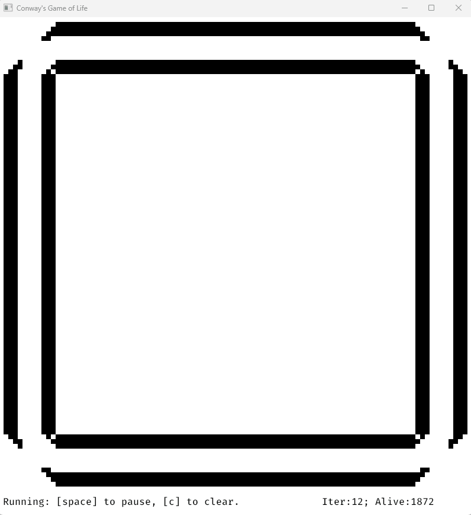

And now, the final full main.rs

```rust
//main.rs
#![warn(clippy::pedantic)]

use bevy::prelude::*;

//Default for the tile sizes.
const TILE_SIZE: u16 = 8;
const STATUS_BAR_PX: f32 = 40.0;
const UPDATE_RATE_SEC: f64 = 0.1;

#[derive(Debug, Default, Clone, Eq, PartialEq, Hash, States)]
enum GameState {
    #[default]
    Running,
    Paused,
}

#[derive(Resource)]
struct Board {
    squares_wide: u16,
    squares_high: u16,
    squares: Vec<Vec<bool>>,
    alive_squares: usize,
}

#[derive(Resource, Default)]
struct GameMetadata {
    iterations: usize
}

#[derive(Component)]
struct IterationText;

#[derive(Component)]
struct GameStateText;

#[derive(Component, Debug)]
struct GridLocation {
    row: u16,
    column: u16
}

#[derive(Event, Default)]
struct BoardNeedsUpdateEvent;

#[derive(Event, Default)]
struct BoardNeedsDrawingEvent;

#[derive(Event, Default)]
struct StatusBarNeedsDrawingEvent;

fn main() {
    println!("Bevy app starting!");
    let cols = 100;
    let rows = 100;
    // Create a 2d vector where every other square is on or off.
    // This is equivalent to a nested for loop over cols then row elements.
    let board_state = (0..cols).map(|col| 
        (0..rows).map(|row| 
            (col + row) % 2 == 0)
            .collect())
    .collect();
    let board = Board {squares_wide: cols, squares_high: rows, squares: board_state, alive_squares: usize::from(cols) * usize::from(rows) / 2};
    let game_metadata = GameMetadata::default();
    let window_width = f32::from(TILE_SIZE * board.squares_wide);
    let window_height =  f32::from(TILE_SIZE * board.squares_high) + STATUS_BAR_PX;
    App::new()
        .add_plugins(
            DefaultPlugins.set(WindowPlugin {
                primary_window: Some(Window {
                    title: "Conway's Game of Life".into(),
                    resolution: (window_width, window_height).into(),
                    ..default()
                }),
                ..default()
            })
        )
        .insert_resource(board)
        .insert_resource(game_metadata)
        .insert_resource(Time::<Fixed>::from_seconds(UPDATE_RATE_SEC))
        .add_event::<BoardNeedsUpdateEvent>()
        .add_event::<BoardNeedsDrawingEvent>()
        .add_event::<StatusBarNeedsDrawingEvent>()
        .add_state::<GameState>()
        .add_systems(FixedUpdate, game_tick_timer.run_if(in_state(GameState::Running)))
        .add_systems(Startup, initial_setup)
        .add_systems(Update, (button_system, keyboard_system, update_board, draw_board, status_bar_text_update).chain())
        .run();
}

#[allow(clippy::needless_pass_by_value)]
fn initial_setup(mut commands: Commands, board: Res<Board>, metadata: ResMut<GameMetadata>) {
    commands.spawn(Camera2dBundle::default());
    //Button style
    let button_style = Style {
        display: Display::Grid,
        justify_content: JustifyContent::Center,
        align_items: AlignItems::Center,
        ..default()
    };
    //Draw the grid layout!
    commands
        .spawn(NodeBundle {
            style: Style {
                //Create a grid layout,
                display: Display::Grid,
                width: Val::Percent(100.0),
                height: Val::Percent(100.0),
                grid_template_columns: vec![
                    GridTrack::auto()
                ],
                //Top Row will take up all the space after the bottom row is complete.
                grid_template_rows: vec![
                    GridTrack::flex(1.0), GridTrack::px(STATUS_BAR_PX)
                ],
                ..default()
            },
            background_color: BackgroundColor(Color::WHITE),
            ..default()
        })
        .with_children(|builder| {
            //Game Area
            builder.spawn(NodeBundle {
                style: Style {
                    //Create a grid layout,
                    display: Display::Grid,
                    width: Val::Percent(100.0),
                    height: Val::Percent(100.0),
                    grid_template_columns: vec![
                        GridTrack::auto(); usize::from(board.squares_wide)
                    ],
                    grid_template_rows: vec![
                        GridTrack::auto(); usize::from(board.squares_high)
                    ],
                    ..default()
                },
                background_color: BackgroundColor(Color::WHITE),
                ..default()
            })
            .with_children(|game_area_builder| {
                //Every other will be black or white!
                for c in 0..board.squares_wide {
                    for r in 0..board.squares_high {
                        //Set the color based on the board state.
                        let color = if board.squares[usize::from(c)][usize::from(r)] {
                            Color::BLACK
                        } else {
                            Color::WHITE
                        };
                        let grid_loc = GridLocation {column: c, row: r};
                        game_area_builder.spawn(
                            (ButtonBundle {
                                style: button_style.clone(),
                                background_color: BackgroundColor(color),
                                ..default()
                            }, grid_loc)
                        );
                    }
                }
            });
            //Status Tray
            builder.spawn(NodeBundle {
                style: Style {
                    display: Display::Grid,
                    padding: UiRect::all(Val::Px(6.0)),
                    grid_template_rows: vec![
                        GridTrack::auto()
                    ],
                    //Left slot, right slot.
                    grid_template_columns: vec![
                        GridTrack::auto(), GridTrack::auto()
                    ],
                    ..default()
                },
                ..default()
            })
            .with_children(|tray_builder| {
                tray_builder.spawn((TextBundle::from_section(
                    "Running: [space] to pause, [c] to clear.",
                    TextStyle {
                        font: Handle::default(),
                        font_size: 20.0,
                        color: Color::BLACK,
                    },
                ), GameStateText));
                tray_builder.spawn((TextBundle::from_section(
                    format!("Iter:{}; Alive:{}", metadata.iterations, board.alive_squares),
                    TextStyle {
                        font: Handle::default(),
                        font_size: 20.0,
                        color: Color::BLACK,
                    },
                ).with_text_alignment(TextAlignment::Right), IterationText));
            });
        });
}

fn game_tick_timer(mut game_board_update_needed: EventWriter<BoardNeedsUpdateEvent>) {
    game_board_update_needed.send_default();
}

#[allow(clippy::type_complexity)]
fn button_system(mut interaction_query: Query<
    (
        &Interaction,
        &GridLocation,
    ),
    (Changed<Interaction>, With<Button>),
>, mut board: ResMut<Board>, mut board_needs_drawing: EventWriter<BoardNeedsDrawingEvent>,
    mut status_bar_needs_update: EventWriter<StatusBarNeedsDrawingEvent>) {
    for (interaction, grid_loc) in &mut interaction_query {
        match *interaction {
            Interaction::Pressed => {
                let r = usize::from(grid_loc.row);
                let c = usize::from(grid_loc.column);
                //Get the game state.
                let cur = board.squares[c][r];
                if cur {
                    board.alive_squares -= 1;
                } else {
                    board.alive_squares += 1;
                }
                println!("Button pressed at ({c},{r}) -- Currently:{cur}");
                board.squares[c][r] = !cur;
                board_needs_drawing.send_default();
                status_bar_needs_update.send_default();
            },
            Interaction::Hovered | Interaction::None => {},
        }
    }
}

#[allow(clippy::needless_pass_by_value)]
fn keyboard_system(keyboard_input: Res<Input<KeyCode>>, game_state: Res<State<GameState>>, mut next_game_state: ResMut<NextState<GameState>>, 
    mut board: ResMut<Board>, mut board_needs_drawing_events: EventWriter<BoardNeedsDrawingEvent>,
    mut board_update_events: EventWriter<BoardNeedsUpdateEvent>, mut status_bar_needs_redraw: EventWriter<StatusBarNeedsDrawingEvent>) {
    if keyboard_input.just_pressed(KeyCode::Space) {
        match game_state.to_owned() {
            GameState::Running => {
                println!("Pausing");
                next_game_state.set(GameState::Paused);
            },
            GameState::Paused => {
                println!("Running");
                next_game_state.set(GameState::Running);
            },
        }
        status_bar_needs_redraw.send_default();
    }
    if keyboard_input.just_pressed(KeyCode::C) {
        println!("Clear");
        for c in 0..usize::from(board.squares_wide) {
            for r in 0..usize::from(board.squares_high) {
                board.squares[c][r] = false;
            }
        }
        board.alive_squares = 0;
        board_needs_drawing_events.send_default();
        status_bar_needs_redraw.send_default();
    }
    if keyboard_input.just_pressed(KeyCode::N) {
        println!("Next");
        //Send an update to update the board state, including the iterations.
        if game_state.to_owned() == GameState::Paused {
            board_update_events.send_default();
        } else {
            println!("Next disabled when not paused.");
        } 
    }
}

#[allow(clippy::type_complexity, clippy::needless_pass_by_value)]
fn status_bar_text_update(mut text_params: ParamSet<(Query<&mut Text, With<GameStateText>>, Query<&mut Text, With<IterationText>>)>, board: Res<Board>,
    metadata: Res<GameMetadata>, next_game_state: Res<NextState<GameState>>, mut status_bar_needs_redraw: EventReader<StatusBarNeedsDrawingEvent>) {
    if status_bar_needs_redraw.is_empty() {
        return;
    }
    status_bar_needs_redraw.clear();
    
    let game_state = next_game_state.0.as_ref().unwrap_or(&GameState::Running);
    let mut game_state_query = text_params.p0();
    match game_state {
        GameState::Running => {
            game_state_query.single_mut().sections[0].value = "Running: [space] to pause, [c] to clear.".to_string();
        },
        GameState::Paused => {
            game_state_query.single_mut().sections[0].value = "Paused: [space] to resume, [c] to clear, [n] for next.".to_string();
        },
    }
    let mut iter_state_query = text_params.p1();
    let new_text = format!("Iter:{}; Alive:{}", metadata.iterations, board.alive_squares);
    iter_state_query.single_mut().sections[0].value = new_text;
}


fn update_board(mut query: Query<&GridLocation>, mut board: ResMut<Board>, mut metadata: ResMut<GameMetadata>,
    mut board_update_events: EventReader<BoardNeedsUpdateEvent>, mut board_needs_draw_event: EventWriter<BoardNeedsDrawingEvent>,
    mut status_bar_needs_update: EventWriter<StatusBarNeedsDrawingEvent>) {
    //Fetch the neighbor counts.
    if board_update_events.is_empty() {
        return;
    }
    board_update_events.clear();
    let neighbor_counts = get_alive_neighbor_counts(board.as_ref());
    let mut alive_count = 0;
    for grid_loc in &mut query {
        let c = usize::from(grid_loc.column);
        let r = usize::from(grid_loc.row);
        let cur = board.squares[c][r];
        let n = neighbor_counts[c][r];
        let mut new_state = cur;
        if cur {
            // Live cell
            //fewer than two live neighbours dies, as if by underpopulation.
            if n < 2 {
                //Underpop
                new_state = false;
            }
            //two or three live neighbours lives on to the next generation.
            if n == 2 || n == 3 {
                //We live!
                new_state = true;
            }
            //more than three live neighbours dies, as if by overpopulation.
            if n > 3 {
                //Overpop
                new_state = false;
            }
        } else {
            // Dead Cell
            //exactly three live neighbours becomes a live cell, as if by reproduction.
            if n == 3 {
                //breeeed
                new_state = true;
            }
        }
        if new_state {
            alive_count += 1;
        }
        //Update the data
        board.squares[c][r] = new_state;
    }
    board.alive_squares = alive_count;
    metadata.iterations += 1;
    board_needs_draw_event.send_default();
    status_bar_needs_update.send_default();
}

#[allow(clippy::needless_pass_by_value)]
fn draw_board(mut query: Query<(&mut BackgroundColor, &GridLocation)>, board: Res<Board>, mut board_needs_draw_events: EventReader<BoardNeedsDrawingEvent>) {
    if board_needs_draw_events.is_empty() {
        return;
    }
    board_needs_draw_events.clear();
    for (mut color, grid_loc) in &mut query {
        let alive = board.squares[usize::from(grid_loc.column)][usize::from(grid_loc.row)];
        if alive {
            *color = Color::BLACK.into();
        } else {
            *color = Color::WHITE.into();
        }
    }
}

fn get_alive_neighbor_counts(board: &Board) -> Vec<Vec<usize>> {
    let height = usize::from(board.squares_high);
    let width = usize::from(board.squares_wide);
    let mut neighbor_counts = vec![vec![0; height]; width];
    for (c, row) in neighbor_counts.iter_mut().enumerate() {
        for (r, item) in  row.iter_mut().enumerate() {
            let mut neighbors = 0;
            //Top
            if r > 0 {
                //T/L
                if c > 0 && board.squares[c-1][r-1] {
                    neighbors += 1;
                }
                //T/C
                if board.squares[c][r-1] {
                    neighbors += 1;
                }
                //T/R
                if c+1 < width && board.squares[c+1][r-1] {
                    neighbors += 1;
                }
            }
            //Left
            if c > 0 && board.squares[c-1][r] {
                neighbors += 1;
            }
            //Right
            if c+1 < width && board.squares[c+1][r] {
                neighbors += 1;
            }
            //Bottom
            if r+1 < height {
                //B/L
                if c > 0 && board.squares[c-1][r+1] {
                    neighbors += 1;
                }
                //B/C
                if board.squares[c][r+1] {
                    neighbors += 1;
                }
                //B/R
                if c+1 < width && board.squares[c+1][r+1] {
                    neighbors += 1;
                }
            }
            *item = neighbors;
        }
    }
    neighbor_counts
}
```

Last reminder — commit it for good measure!

`git commit -a -m “Make board 100x100 and optimize dependencies.”`

## Wrap it up!

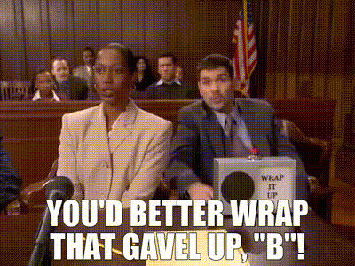

That wraps up our Bevy game of life tutorial! Thank you for reading, and I hope you had fun running through it with me! Please feel free to reach out if there are any areas that need to be clarified or corrected.

For additional fun there are a few things I didn’t add to the game that would be nice features.
* Add the ability to go back in history up to N iterations via a ‘previous’ keypress.
* Game menu with configurable items like board size, game speed, game color scheme, etc.
* The ability to resize the game’s window up and down including automatic tile scaling.
* Add ability to ‘load’ a csv of various board states to try out different scenarios.
* Add a ‘clear and randomize’ option as a keypress that restarts the sim with the squares in a random on/off configuration.
